# BCG case

This pipeline is intended for use with three levels of proteomics data:
total proteome, phosphoproteome, and histone proteome. See Schaefer et
al. (2024) for more detail on the total and histone proteome;
phosphoproteome data is from Choudhary et al. (2020). Total and
phosphoproteome data are designed to be input as an Excel sheet from
Proteome Discoverer, and the histone data are the aggregated ratios from
EpiProfile (Yuan et al. (2018)).

The full R Markdown source document can be downloaded from this page by
clicking the Source link above. Additionally, we have made available the
files generated from our data at the project repository on Github. Other
files can be downloaded from their respective sources.

Most variables that need to be adjusted for individual datasets should
be set here.

``` r

total_p_threshold <- 0.05
total_FC_threshold <- 0.5
phospho_p_threshold <- 0.05
phospho_FC_threshold <- 0.5
histone_p_threshold <- 0.05
histone_FC_threshold <- 0.5
```

If you have not previously set up a Python environment from RStudio, run
this chunk.

``` r

virtualenv_create("r-reticulate")
#> Using Python: /usr/bin/python3.12
#> Creating virtual environment 'r-reticulate' ...
#> + /usr/bin/python3.12 -m venv /home/runner/.virtualenvs/r-reticulate
#> Done!
#> Installing packages: pip, wheel, setuptools
#> + /home/runner/.virtualenvs/r-reticulate/bin/python -m pip install --upgrade pip wheel setuptools
#> Installing packages: numpy
#> + /home/runner/.virtualenvs/r-reticulate/bin/python -m pip install --upgrade --no-user numpy
#> Virtual environment 'r-reticulate' successfully created.
use_virtualenv("r-reticulate")
virtualenv_install("r-reticulate", c("pandas", "networkx", "pyvis"), action = "add")
#> Using virtual environment 'r-reticulate' ...
#> + /home/runner/.virtualenvs/r-reticulate/bin/python -m pip install --upgrade --no-user pandas networkx pyvis
```

## 1. Proteome data processing

This section prepares proteome data. For data other than the example,
read in the data in place of the
[`data()`](https://rdrr.io/r/utils/data.html) call.

``` r

data(THP1_total)
# Renaming to reader-friendly names
THP1_total <- dplyr::rename(THP1_total, all_of(c(
  "log2(FC)" = "Abundance Ratio (log2): (JMI) / (Control)",
  "P value" = "Abundance Ratio Adj. P-Value: (JMI) / (Control)"
)))
# Mapping ENTREZ IDs and a gene symbol column to UniProt IDs for later analysis
THP1_total <- dplyr::left_join(THP1_total, OrganismDbi::select(
  Homo.sapiens::Homo.sapiens,
  keys = OrganismDbi::keys(Homo.sapiens::Homo.sapiens, keytype = "UNIPROT"),
  columns = c("ENTREZID", "SYMBOL"), keytype = "UNIPROT"
), by = dplyr::join_by(Accession == UNIPROT), keep = FALSE)
#> 'select()' returned 1:many mapping between keys and columns
# Dropping anything with an undefined or duplicate symbol
THP1_total <- THP1_total %>%
  tidyr::drop_na(SYMBOL) %>%
  dplyr::distinct(SYMBOL, .keep_all = TRUE)
# Assigning row names
THP1_total <- THP1_total %>%
  dplyr::mutate("SYMBOL2" = `SYMBOL`) %>%
  tibble::column_to_rownames(var = "SYMBOL") %>% 
  dplyr::rename("Symbol" = "SYMBOL2")
# Calculating Storey's q-value for FDR estimation
THP1_total$`Q value` <- qvalue(THP1_total$`P value`)$qvalues

# Creating a separate set of significant points for later analysis
THP1_total_sig <- dplyr::filter(THP1_total, `Q value` < total_p_threshold)
THP1_total_sig_unadj <- dplyr::filter(THP1_total, `P value` < total_p_threshold)
```

### 1.1. Volcano plots

Here we create several volcano plots to show the data.

``` r

# Setting this value - geom_text_repel will only show so many labels at once
# for legibility reasons. Adjust this threshold to show more/fewer points.
options("ggrepel.max.overlaps" = 20)

volcanoplot(df = THP1_total, fc_col = "log2(FC)",
            p_col = "Q value", label_col = "Symbol") +
  ggtitle("Volcano plot") + xlab("log2(FC)") + ylab("-log10(Q-value)")
```

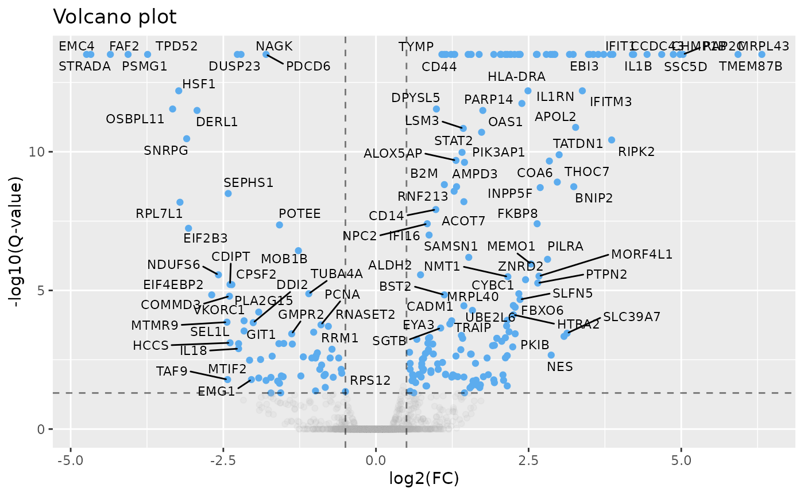

If you have known proteins of interest, use
[`volcano_groups()`](https://zoe-schaefer.github.io/MPOInt/reference/volcano_groups.md)
to highlight them on a graph.

``` r

# For known groups of interest
volcano_groups(df = THP1_total, fc_col = "log2(FC)", p_col = "Q value", label_col = "Symbol",
  group_list = list("Group 1: Epigenome" = c("MORF4L1", "SAMSN1", "DTX3L", "HSF1",
  "EYA3", "NCAPD2", "TAF9"), "Group 2: Infection" = c("NFKB1", "BST2", "CTSH", "TLR2", "ITGAM", "MMP9", "MX1", "MX2", "C1QBP", "HLA-DRA"))) +
  scale_color_manual(values = c("Group 1: Epigenome" = "red", "Group 2: Infection" = "blue", "None" = "gray")) +
  ggtitle("Grouped volcano plot") + xlab("log2FC") + ylab("-log10(Q-value)")
```

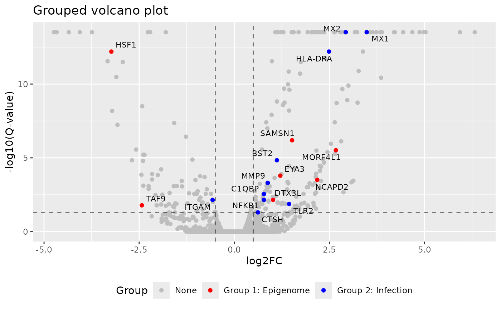

### 1.2. GSEA

This section prepares and performs a GSEA analysis on the total proteome
data using the clusterProfiler package.

``` r

# Need a named list in decreasing order
total_GSEA_list <- THP1_total$`log2(FC)`
names(total_GSEA_list) <- THP1_total$ENTREZID
total_GSEA_list <- na.omit(total_GSEA_list)
total_GSEA_list <- sort(total_GSEA_list, decreasing = TRUE)
```

``` r

total_GSEA_GO <- gseGO(geneList = total_GSEA_list, OrgDb = "org.Hs.eg.db",
                    verbose = FALSE, ont = "ALL")
#> Warning in prepare_gsea_inputs(geneList, scoreType, exponent): There are ties
#> in the preranked stats (86.12% of the list). The order of those tied genes will
#> be arbitrary, which may produce unexpected results.
#> Warning in gsea(geneList = geneList, gene_sets = geneSets, minGSSize =
#> minGSSize, : There were 530 pathways for which P-values were not calculated
#> properly due to unbalanced gene-level statistic values. For such pathways
#> pvalue, NES and log2err are set to NA. You can try to increase nPermSimple.
#> Warning in calculate_qvalue(gsea_res$pvalue): Invalid p-values detected (NA,
#> non-finite, <0, or >1). qvalue will be computed on valid p-values only.
#> Warning in enrichit::gsea_gson(geneList = geneList, exponent = exponent, : NA
#> values detected in gene set IDs. Replacing with string 'NA'.
#> Warning in enrichit::gsea_gson(geneList = geneList, exponent = exponent, :
#> Duplicate gene set IDs detected: NA... (Total 1). Unique suffixes added.
total_GSEA_KEGG <- gseKEGG(geneList = total_GSEA_list, verbose = FALSE)
#> Reading KEGG annotation online: "https://rest.kegg.jp/link/hsa/pathway"...
#> Reading KEGG annotation online: "https://rest.kegg.jp/list/pathway/hsa"...
#> Warning in prepare_gsea_inputs(geneList, scoreType, exponent): There are ties
#> in the preranked stats (86.12% of the list). The order of those tied genes will
#> be arbitrary, which may produce unexpected results.
#> Warning in gsea(geneList = geneList, gene_sets = geneSets, minGSSize =
#> minGSSize, : There were 2 pathways for which P-values were not calculated
#> properly due to unbalanced gene-level statistic values. For such pathways
#> pvalue, NES and log2err are set to NA. You can try to increase nPermSimple.
#> Warning in calculate_qvalue(gsea_res$pvalue): Invalid p-values detected (NA,
#> non-finite, <0, or >1). qvalue will be computed on valid p-values only.
#> Warning in enrichit::gsea_gson(geneList = geneList, exponent = exponent, : NA
#> values detected in gene set IDs. Replacing with string 'NA'.
#> Warning in enrichit::gsea_gson(geneList = geneList, exponent = exponent, :
#> Duplicate gene set IDs detected: NA... (Total 1). Unique suffixes added.
```

Plotting GSEA dot plots can be difficult due to the volume of
information included. Changing the value of `label_format` adjusts the
label wrapping, which can help crowded figures.

``` r

if (nrow(total_GSEA_GO@result) > 0) {
  dotplot(total_GSEA_GO, showCategory = 20, font.size = rel(1), label_format = 40, title = "Total GO enrichment",
          split = "ONTOLOGY") + facet_wrap(ONTOLOGY~.sign)
} else {
  print("Error: no terms enriched under P-value cutoff (total_GSEA_GO)")
}
```

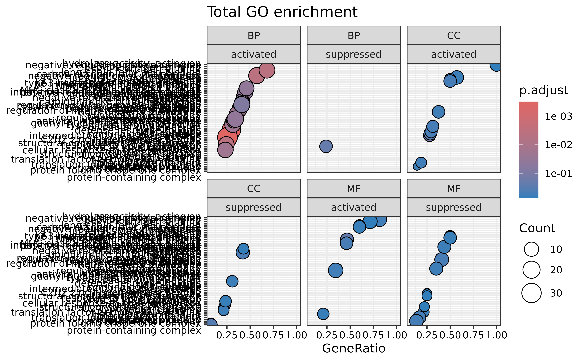

``` r


if (nrow(total_GSEA_KEGG@result) > 0) {
  dotplot(total_GSEA_KEGG, showCategory = 20, font.size = rel(1), label_format = 40, title = "Total KEGG enrichment",
          split = ".sign") + facet_wrap(.~.sign)
} else {
  print("Error: no terms enriched under P-value cutoff (total_GSEA_KEGG)")
}
```

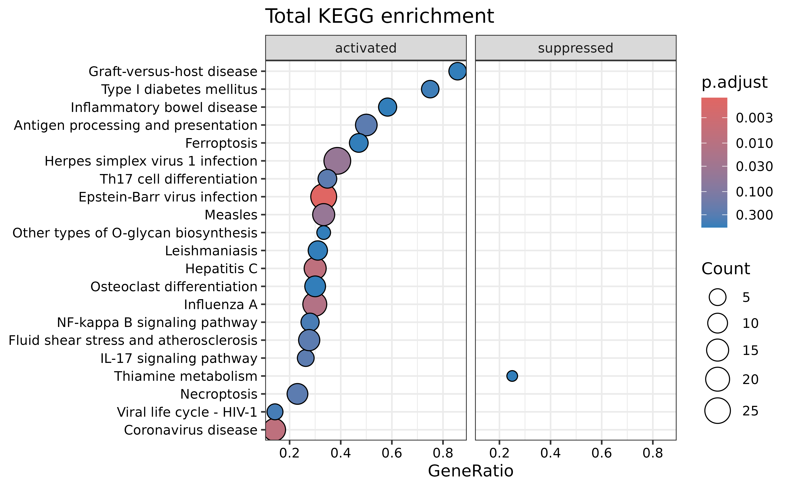

``` r

# Clearing large variables
rm(THP1_total, total_GSEA_GO, total_GSEA_KEGG, total_GSEA_list)
```

## 2. Phosphoproteome data processing

Similar to the previous section, this prepares phosphoproteome data.

``` r

# Renaming to reader-friendly names not necessary here
data(THP1_phospho)
# Mapping ENTREZ IDs and a gene symbol column to UniProt IDs for later analysis
THP1_phospho <- dplyr::left_join(THP1_phospho, OrganismDbi::select(
  Homo.sapiens::Homo.sapiens,
  keys = OrganismDbi::keys(Homo.sapiens::Homo.sapiens, keytype = "ENTREZID"),
  columns = c("UNIPROT", "SYMBOL"), keytype = "ENTREZID"
), by = dplyr::join_by(SYMBOL2 == SYMBOL, ENTREZID), keep = FALSE, relationship = "many-to-many")
#> 'select()' returned 1:many mapping between keys and columns
# Dropping anything with an undefined or duplicate symbol
THP1_phospho <- THP1_phospho %>%
  tidyr::drop_na(SYMBOL2) %>%
  dplyr::distinct(SYMBOL2, .keep_all = TRUE)
# Assigning row names
THP1_phospho <- THP1_phospho %>%
  dplyr::mutate("SYMBOL" = `SYMBOL2`) %>%
  tibble::column_to_rownames(var = "SYMBOL") %>% 
  dplyr::rename("Symbol" = "SYMBOL2")
THP1_phospho$`Q value` <- qvalue(THP1_phospho$`P value`)$qvalues

# Creating a separate set of significant points for later analysis
THP1_phospho_sig_unadj <- dplyr::filter(THP1_phospho, `P value` < phospho_p_threshold)
THP1_phospho_sig <- dplyr::filter(THP1_phospho, `Q value` < phospho_p_threshold)
```

### 2.1. Volcano plots

``` r

# Setting this value - geom_text_repel will only show so many labels at once
# for legibility reasons. Adjust this threshold to show more/fewer points.
options("ggrepel.max.overlaps" = 20)

volcanoplot(df = THP1_phospho, fc_col = "log2(FC)",
            p_col = "Q value", label_col = "Symbol") +
  ggtitle("Volcano plot") + xlab("log2(FC)") + ylab("-log10(Q-value)")
```

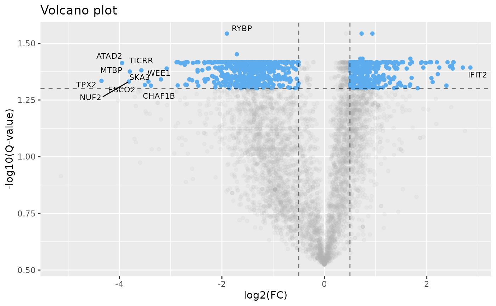

``` r

# For known groups of interest
volcano_groups(df = THP1_phospho, fc_col = "log2(FC)", p_col = "Q value", label_col = "Symbol",
  group_list = list("Group 1: Chromatin" = c("ASH2L", "ASXL1", "ASXL2", "BAP1", "BMI1", "CHD4", "EZH2", "DMAP1",
  "EP400", "KANSL1", "KANSL3", "KMT2D", "MBD3",
  "MEN1", "MGA", "MRGBP", "MTA1", "NCOA6", "REST",
  "RING1", "RUVBL1", "SAP130", "SIRT3", "SIRT6", "EP300"), "Group 2: NMIBC" = c("FANCI", "CDK14", "ICAM1", "CDK1", "NOTCH3", "CASP8",
  "BST2", "CTSL", "MX2", "CASP1", "MX1"))) +
  scale_color_manual(values = c("Group 1: Chromatin" = "red", "Group 2: NMIBC" = "blue", "None" = "gray")) +
  ggtitle("Grouped volcano plot") + xlab("log2FC") + ylab("-log10(Q-value)")
```

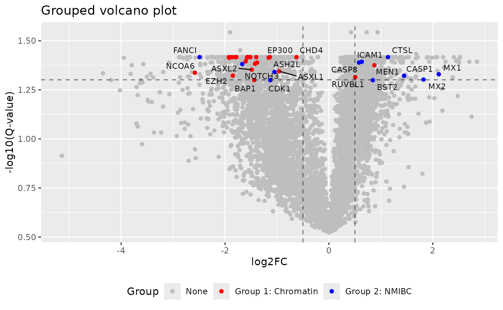

### 2.2. GSEA

``` r

# Need a named list in decreasing order
phospho_GSEA_list <- THP1_phospho$`log2(FC)`
names(phospho_GSEA_list) <- THP1_phospho$ENTREZID
phospho_GSEA_list <- na.omit(phospho_GSEA_list)
phospho_GSEA_list <- sort(phospho_GSEA_list, decreasing = TRUE)
```

Here we use the `simplify` function from clusterProfiler to combine
redundant GSEA terms by similarity. This allows more unique pathways to
be displayed.

``` r

phospho_GSEA_GO <- gseGO(geneList = phospho_GSEA_list, OrgDb = "org.Hs.eg.db",
                    verbose = FALSE, ont = "ALL")
#> Warning in prepare_gsea_inputs(geneList, scoreType, exponent): There are ties
#> in the preranked stats (2.95% of the list). The order of those tied genes will
#> be arbitrary, which may produce unexpected results.
#> Warning in gsea(geneList = geneList, gene_sets = geneSets, minGSSize =
#> minGSSize, : There were 210 pathways for which P-values were not calculated
#> properly due to unbalanced gene-level statistic values. For such pathways
#> pvalue, NES and log2err are set to NA. You can try to increase nPermSimple.
#> Warning in gsea(geneList = geneList, gene_sets = geneSets, minGSSize =
#> minGSSize, : For some pathways, in reality P-values are less than 1e-10. You
#> can set the eps argument to zero for better estimation.
#> Warning in calculate_qvalue(gsea_res$pvalue): Invalid p-values detected (NA,
#> non-finite, <0, or >1). qvalue will be computed on valid p-values only.
#> Warning in enrichit::gsea_gson(geneList = geneList, exponent = exponent, : NA
#> values detected in gene set IDs. Replacing with string 'NA'.
#> Warning in enrichit::gsea_gson(geneList = geneList, exponent = exponent, :
#> Duplicate gene set IDs detected: NA... (Total 1). Unique suffixes added.
# By visual inspection of graphs, this contained redundant terms - use simplify() to reduce if desired
# simple_phospho_GSEA_GO <- clusterProfiler::simplify(phospho_GSEA_GO)
phospho_GSEA_KEGG <- gseKEGG(geneList = phospho_GSEA_list, verbose = FALSE)
#> Warning in prepare_gsea_inputs(geneList, scoreType, exponent): There are ties
#> in the preranked stats (2.95% of the list). The order of those tied genes will
#> be arbitrary, which may produce unexpected results.
#> Warning in gsea(geneList = geneList, gene_sets = geneSets, minGSSize =
#> minGSSize, : There were 21 pathways for which P-values were not calculated
#> properly due to unbalanced gene-level statistic values. For such pathways
#> pvalue, NES and log2err are set to NA. You can try to increase nPermSimple.
#> Warning in gsea(geneList = geneList, gene_sets = geneSets, minGSSize =
#> minGSSize, : For some pathways, in reality P-values are less than 1e-10. You
#> can set the eps argument to zero for better estimation.
#> Warning in calculate_qvalue(gsea_res$pvalue): Invalid p-values detected (NA,
#> non-finite, <0, or >1). qvalue will be computed on valid p-values only.
#> Warning in enrichit::gsea_gson(geneList = geneList, exponent = exponent, : NA
#> values detected in gene set IDs. Replacing with string 'NA'.
#> Warning in enrichit::gsea_gson(geneList = geneList, exponent = exponent, :
#> Duplicate gene set IDs detected: NA... (Total 1). Unique suffixes added.
```

``` r

if (nrow(phospho_GSEA_GO@result) > 0) {
  dotplot(phospho_GSEA_GO, showCategory = 20, font.size = rel(1), label_format = 50, title = "Phospho GO enrichment",
          split = "ONTOLOGY") + facet_wrap(ONTOLOGY~.sign, scales = "free_y", ncol = 2)
} else {
  print("Error: no terms enriched under P-value cutoff (phospho_GSEA_GO)")
}
```

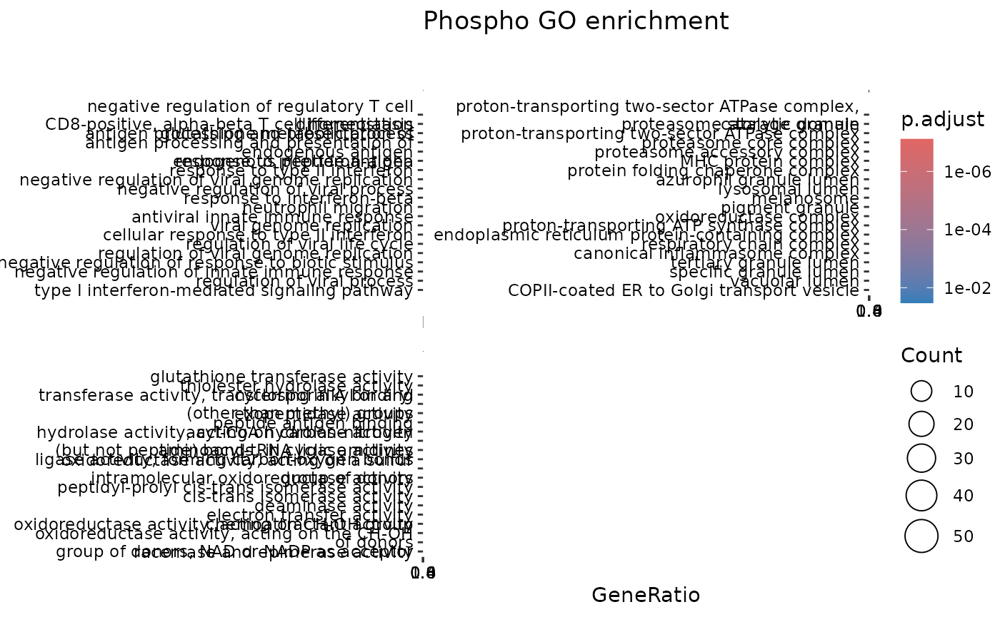

``` r


if (nrow(phospho_GSEA_KEGG@result) > 0) {
  dotplot(phospho_GSEA_KEGG, showCategory = 20, font.size = rel(1), label_format = 40, title = "Phospho KEGG enrichment",
          split = ".sign") + facet_wrap(.~.sign, scales = "free", ncol = 2)
} else {
  print("Error: no terms enriched under P-value cutoff (phospho_GSEA_KEGG)")
}
```

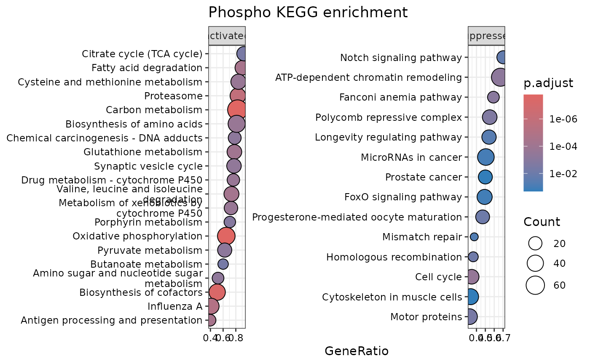

``` r

# Clearing large variables
rm(phospho_GSEA_GO, phospho_GSEA_KEGG, THP1_phospho,
   phospho_GSEA_list)
```

## 3. Histone processing

This section processes EpiProfile output into a more readable,
user-friendly format. We also perform basic statistical analysis and log
transformations on the data.

``` r

data(THP1_histones)
histone_single_raw <- clean_names(THP1_histones, "PTM")[[1]]
histone_frag_raw <- clean_names(THP1_histones, "PTM")[[2]]
```

We separate out the histone fragments containing co-occurring PTMs from
the individual PTMs and present both individually. This allows for
discovery with complexes that require two or more targets, but also
provides a clear picture of overall PTM changes. Here, we group our two
conditions together, marked by columns that start with “I” for infected
cells or “C” for control.

### 3.1. Fragments

``` r

# Get the log2-transformed fold change and BH-adjusted P values
histone_frag <- histone_epi(df = histone_frag_raw, label_col = "PTM",
                           base_cols = c("C1", "C2", "C3", "C4", "C5"),
                           target_cols = c("I1", "I2", "I3", "I4", "I5"))
#> Joining with `by = join_by(C1, C2, C3, C4, C5, I1, I2, I3, I4, I5, base_mean,
#> target_mean, `log2(FC)`, is_constant, PTM)`
```

The
[`volcano_epi()`](https://zoe-schaefer.github.io/MPOInt/reference/volcano_epi.md)
function plots the epiproteome data, assuming that all values have
already been transformed and statistical analysis has already been
performed. To address infinite fold change values that appear when a
protein is not detected in one condition, it also sets them to have a
unique shape in the final plot and assigns a fold change value equal to
2.5 times the maximum valid value.

``` r

# Setting this value - geom_text_repel will only show so many labels at once
# for legibility reasons. Adjust this threshold to show more/fewer points.
options("ggrepel.max.overlaps" = 20)

volcano_epi(df = histone_frag, fc_col = "log2(FC)",
            p_col = "P value", label_col = "PTM", p_thr = 0.1) +
  labs(title = "Volcano plot", x = "log2(FC)", y = "-log10(P-value)")
#> Joining with `by = join_by(C1, C2, C3, C4, C5, I1, I2, I3, I4, I5, base_mean,
#> target_mean, `log2(FC)`, is_constant, PTM, P_unadj, `P value`, shape_col,
#> x_col, p_raw, p_log10, DiffExp, labels)`
```

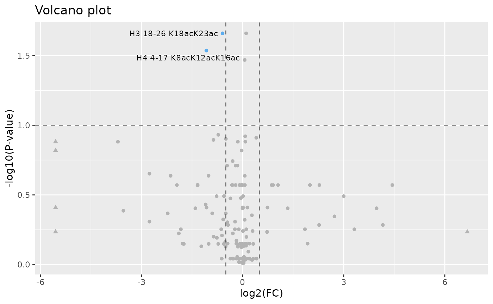

### 3.2. Single

This section parses the fragments into single PTMs. Each occurrence is
counted individually - for example, H4 4-17 K5acK12acK16ac would be
counted as H4K5ac, H4K8ac, and H4K16ac.

``` r

histone_single <- histone_epi(df = histone_single_raw, label_col = "PTM",
                           base_cols = c("C1", "C2", "C3", "C4", "C5"),
                           target_cols = c("I1", "I2", "I3", "I4", "I5"))
#> Joining with `by = join_by(C1, C2, C3, C4, C5, subset, I1, I2, I3, I4, I5,
#> base_mean, target_mean, `log2(FC)`, is_constant, PTM)`
```

``` r

# Setting this value - geom_text_repel will only show so many labels at once
# for legibility reasons. Adjust this threshold to show more/fewer points.
options("ggrepel.max.overlaps" = 20)

volcano_epi(df = histone_single, fc_col = "log2(FC)",
            p_col = "P_unadj", label_col = "PTM", p_thr = 0.05) +
  labs(title = "Volcano plot", x = "log2(FC)", y = "-log10(P-value)") 
#> Joining with `by = join_by(C1, C2, C3, C4, C5, subset, I1, I2, I3, I4, I5,
#> base_mean, target_mean, `log2(FC)`, is_constant, PTM, P_unadj, `P value`,
#> shape_col, x_col, p_raw, p_log10, DiffExp, labels)`
```

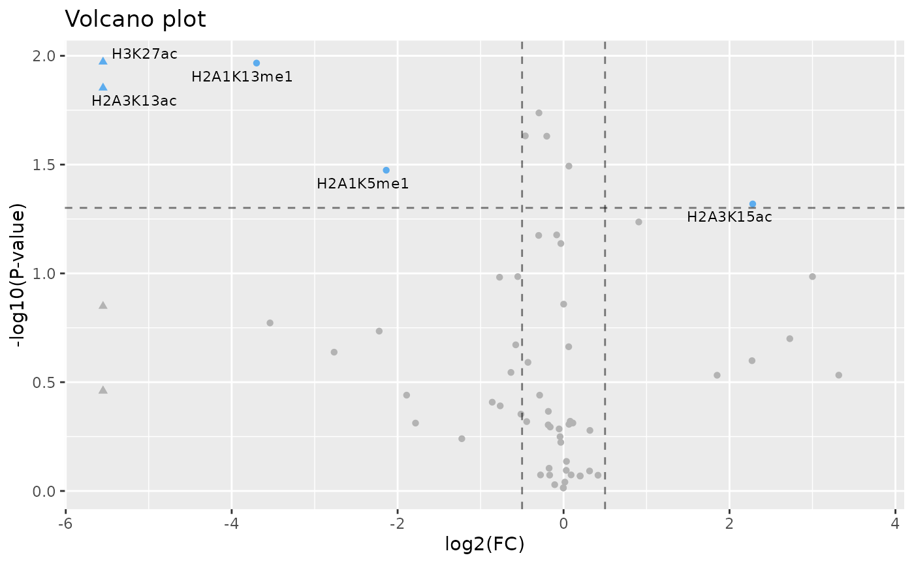

``` r

# Clearing large variables
rm(THP1_histones, histone_single_raw, histone_frag_raw)
```

## 4. Disease enrichment

Here we perform disease enrichment using the [MSigDB
database](https://www.gsea-msigdb.org/gsea/msigdb/human/genesets.jsp)
and the MSigDBR package. First, identify a dataset of interest in the
database. The next chunk shows databases sourced through MSigDB but
originating from WikiPathways, Human Phenotype Ontology, and Reactome.
The `collection` parameter identifies the MSigDB collection to search,
followed by `gs_exact_source` that specifies the selected dataset. This
can also be replaced with `gs_id` if you are using the “Systematic name”
value on the website.

We enrich our primary disease of interest (bladder cancer), but also
include enrichment for melanoma and RSV, two potential areas of BCG
application.

``` r

GDA_BlCa <- msigdbr(collection = "C2") %>% filter(gs_exact_source == "WP2828")
GDA_melanoma <- msigdbr(collection = "C5") %>% filter(gs_exact_source == "HP:0002861")
GDA_RSV <- msigdbr(collection = "C2") %>% filter(gs_exact_source == "R-HSA-9833110")
```

This chunk creates Venn diagrams of the overlap between proteins that
were significant and above the fold change threshold in the total
proteome and phosphoproteome, as well as the genes of interest that were
just retrieved.

``` r

# Get lists of proteins that were significant AND above the FC threshold
total_FC <- filter(THP1_total_sig, abs(`log2(FC)`) > total_FC_threshold)
phospho_FC <- filter(THP1_phospho_sig, abs(`log2(FC)`) > phospho_FC_threshold)

# Generate plot
ggvenn(list(
  "NMIBC" = GDA_BlCa$gene_symbol,
  "Total proteome" = total_FC$Symbol,
  "Phosphoproteome" = phospho_FC$Symbol),
  fill_color = c("#440154", "#21908C", "#FDE725"),
  show_percentage = FALSE, text_size = 5) + ggtitle("BCG enrichment") + theme(
  plot.title.position = "plot",
  plot.title = element_text(hjust = 0.5))
```

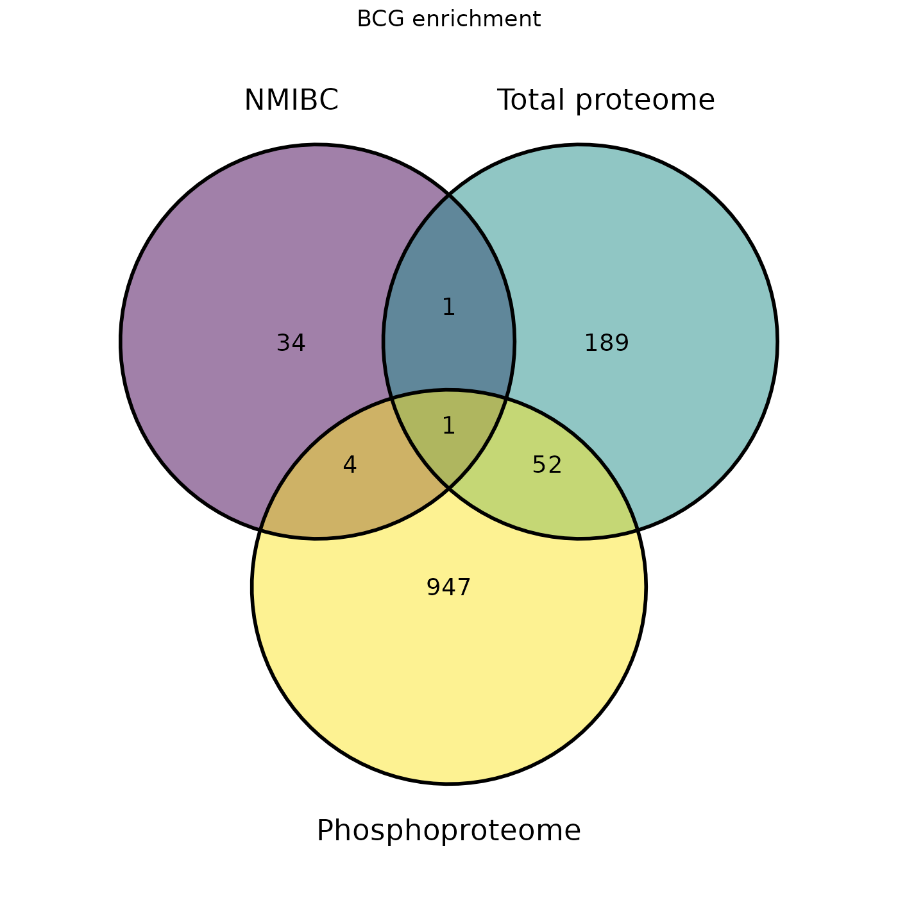

``` r


ggvenn(list(
  "Melanoma" = GDA_melanoma$gene_symbol,
  "Total proteome" = total_FC$Symbol,
  "Phosphoproteome" = phospho_FC$Symbol),
  fill_color = c("#440154", "#21908C", "#FDE725"),
  show_percentage = FALSE, text_size = 5) + ggtitle("BCG enrichment") + theme(
  plot.title.position = "plot",
  plot.title = element_text(hjust = 0.5))
```


``` r


ggvenn(list(
  "RSV" = GDA_RSV$gene_symbol,
  "Total proteome" = total_FC$Symbol,
  "Phosphoproteome" = phospho_FC$Symbol),
  fill_color = c("#440154", "#21908C", "#FDE725"),
  show_percentage = FALSE, text_size = 10) + ggtitle("BCG enrichment") + theme(
  plot.title.position = "plot",
  plot.title = element_text(hjust = 0.5))
```


We next print a list of proteins in the four intersecting areas for
further investigation in our disease of interest.

``` r

# Print the list of proteins in each intersection
BlCa_intersections <- data.frame("Intersection" = character(),
                                 "Hits" = character(),
                                 stringsAsFactors = FALSE)
BlCa_intersections <- BlCa_intersections %>%
  add_row("Intersection" = "Bladder cancer/Phospho",
          "Hits" = paste(sort(intersect(GDA_BlCa$gene_symbol, phospho_FC$Symbol)),
                         collapse = ", ")) %>% 
  add_row("Intersection" = "Bladder cancer/Total",
          "Hits" = paste(sort(intersect(GDA_BlCa$gene_symbol, total_FC$Symbol)),
                         collapse = ", ")) %>% 
  add_row("Intersection" = "Total/Phospho",
          "Hits" = paste(sort(intersect(total_FC$Symbol, phospho_FC$Symbol)),
                         collapse = ", ")) %>% 
  add_row("Intersection" = "Bladder cancer/Phospho/Total",
          "Hits" = paste(sort(intersect(intersect(
            GDA_BlCa$gene_symbol, phospho_FC$Symbol),
            total_FC$Symbol)), collapse = ", "))

knitr::kable(BlCa_intersections, caption = "Bladder cancer intersections")
```

| Intersection | Hits |
|:---|:---|
| Bladder cancer/Phospho | BRAF, NRAS, RAF1, RB1, TYMP |
| Bladder cancer/Total | MMP9, TYMP |
| Total/Phospho | ACSL1, ALDH2, CMPK2, CNP, DDI2, DERL1, EIF2AK2, EYA3, FKBP8, FTL, GBP1, HELZ2, HMBS, HMOX1, ICAM1, IFI16, IFI44, IFIH1, IFIT1, IFIT2, IFIT3, INPP5F, ISG15, LSM3, MOB1B, MX1, MX2, NAGK, OAS1, OAS3, OASL, PARP14, PKIB, RIGI, RNF213, RRM1, RSAD2, SAMD9, SIRPA, SIRT2, SLFN5, SNRPG, SRSF10, STAT1, STRADA, SULT1A1, TAP2, TAPBP, TUBA1A, TYMP, UBE2D3, UBE2L6, VKORC1 |
| Bladder cancer/Phospho/Total | TYMP |

Bladder cancer intersections {.table}

``` r

melanoma_intersections <- data.frame("Intersection" = character(),
                                 "Hits" = character(),
                                 stringsAsFactors = FALSE)
melanoma_intersections <- melanoma_intersections %>%
  add_row("Intersection" = "Melanoma/Phospho",
          "Hits" = paste(sort(intersect(GDA_melanoma$gene_symbol,
                                        phospho_FC$Symbol)),
                         collapse = ", ")) %>% 
  add_row("Intersection" = "Melanoma/Total",
          "Hits" = paste(sort(intersect(GDA_melanoma$gene_symbol,
                                        total_FC$Symbol)),
                         collapse = ", ")) %>% 
  add_row("Intersection" = "Total/Phospho",
          "Hits" = paste(sort(intersect(total_FC$Symbol, phospho_FC$Symbol)),
                         collapse = ", ")) %>% 
  add_row("Intersection" = "Melanoma/Phospho/Total",
          "Hits" = paste(sort(intersect(intersect(
            GDA_melanoma$gene_symbol, phospho_FC$Symbol),
            total_FC$Symbol)), collapse = ", "))

knitr::kable(melanoma_intersections, caption = "Melanoma intersections")
```

| Intersection | Hits |
|:---|:---|
| Melanoma/Phospho | ACD, ANAPC1, ATM, BARD1, BRAF, BRCA1, CHEK2, FLCN, MITF, NRAS, PALB2, RAF1, RECQL4, STK11, TERF2IP, ZEB2 |
| Melanoma/Total |  |
| Total/Phospho | ACSL1, ALDH2, CMPK2, CNP, DDI2, DERL1, EIF2AK2, EYA3, FKBP8, FTL, GBP1, HELZ2, HMBS, HMOX1, ICAM1, IFI16, IFI44, IFIH1, IFIT1, IFIT2, IFIT3, INPP5F, ISG15, LSM3, MOB1B, MX1, MX2, NAGK, OAS1, OAS3, OASL, PARP14, PKIB, RIGI, RNF213, RRM1, RSAD2, SAMD9, SIRPA, SIRT2, SLFN5, SNRPG, SRSF10, STAT1, STRADA, SULT1A1, TAP2, TAPBP, TUBA1A, TYMP, UBE2D3, UBE2L6, VKORC1 |
| Melanoma/Phospho/Total |  |

Melanoma intersections {.table}

``` r

RSV_intersections <- data.frame("Intersection" = character(),
                                 "Hits" = character(),
                                 stringsAsFactors = FALSE)
RSV_intersections <- RSV_intersections %>%
  add_row("Intersection" = "RSV/Phospho",
          "Hits" = paste(sort(intersect(GDA_RSV$gene_symbol, phospho_FC$Symbol)),
                         collapse = ", ")) %>% 
  add_row("Intersection" = "RSV/Total",
          "Hits" = paste(sort(intersect(GDA_RSV$gene_symbol, total_FC$Symbol)),
                         collapse = ", ")) %>% 
  add_row("Intersection" = "Total/Phospho",
          "Hits" = paste(sort(intersect(total_FC$Symbol, phospho_FC$Symbol)),
                         collapse = ", ")) %>% 
  add_row("Intersection" = "RSV/Phospho/Total",
          "Hits" = paste(sort(intersect(intersect(
            GDA_RSV$gene_symbol, phospho_FC$Symbol),
            total_FC$Symbol)), collapse = ", "))

knitr::kable(RSV_intersections, caption = "RSV intersections")
```

| Intersection | Hits |
|:---|:---|
| RSV/Phospho | CUL5, EIF2AK2, ELOC, EP300, IFIH1, ISG15, MED1, MED12, RIGI, TRIM25, UBE2L6 |
| RSV/Total | CD14, EIF2AK2, IFIH1, ISG15, OAS2, RIGI, STAT2, TLR2, UBE2L6 |
| Total/Phospho | ACSL1, ALDH2, CMPK2, CNP, DDI2, DERL1, EIF2AK2, EYA3, FKBP8, FTL, GBP1, HELZ2, HMBS, HMOX1, ICAM1, IFI16, IFI44, IFIH1, IFIT1, IFIT2, IFIT3, INPP5F, ISG15, LSM3, MOB1B, MX1, MX2, NAGK, OAS1, OAS3, OASL, PARP14, PKIB, RIGI, RNF213, RRM1, RSAD2, SAMD9, SIRPA, SIRT2, SLFN5, SNRPG, SRSF10, STAT1, STRADA, SULT1A1, TAP2, TAPBP, TUBA1A, TYMP, UBE2D3, UBE2L6, VKORC1 |
| RSV/Phospho/Total | EIF2AK2, IFIH1, ISG15, RIGI, UBE2L6 |

RSV intersections {.table}

``` r

# Clearing large variables
rm(GDA_BlCa, GDA_melanoma, GDA_RSV, BlCa_intersections, melanoma_intersections, RSV_intersections)
```

## 5. Epigenetic network

This section develops a network visualization of all epigenetic
interactions as defined by EpiFactors
(<https://epifactors.autosome.org/>). Increased dataset size may make
networks difficult to visualize, so an interactive network is drawn in
Python and rendered as an embedded HTML file.

The `data(genes)` call imports a .csv file included with the MPOInt
package, but can be replaced to update or change the database by
downloading and importing the “Table of all proteins” file on the
EpiFactors website.

It is important to note that here we choose to use all histones
identified and limit the proteome/phosphoproteome by unadjusted P value
rather than the FDR-corrected Q value. Given that this tool is intended
for discovery and requires downstream validation of its findings, as
well as the lack of in-depth resources detailing epigenetic
interactions, we chose to include as many potential hits as possible,
then evaluate the findings based on the context of the overall developed
network in addition to the epiproteome fragment analysis. Below, we also
generate a smaller network abiding by more rigorous statistical
standards as a demonstration.

### 5.1 Complex and member identification

For future research use, we generate multiple tables containing the
identified complexes, members, common targets, and identified PTMs.

``` r

# Adding framework for connections
data(genes)
# Creating the network object with the significant peptide subsets
net_created <- 
  multi_net(genes_df = genes, total_df = THP1_total_sig_unadj,
            phospho_df = THP1_phospho_sig_unadj,
            # Point to the gene symbols and transformed FC values
            symbol_col = "Symbol", fc_col = "log2(FC)",
            # The network will not assemble with the fragment data
            epi_single_df = histone_single,
            epi_symbol_col = "PTM", epi_fc_col = "log2(FC)")
#> Joining with `by = join_by(`HGNC approved symbol`, `UniProt ID (human)`,
#> Function, Modification, `Protein complex`, `Target entity`, Product,
#> `log2(FC)`, Source)`

# Accessing the plots and lists created as part of the object
net_created$grid
```

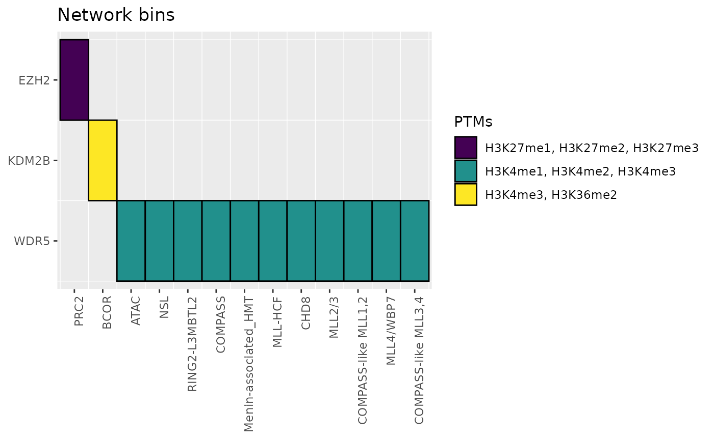

``` r

net_created$complex_list
#>  [1] "ATAC"                 "BAF"                  "BCOR"                
#>  [4] "BRCA1-A"              "BRCC"                 "CAF-1"               
#>  [7] "CHD8"                 "COMPASS"              "COMPASS-like MLL1,2" 
#> [10] "COMPASS-like MLL3,4"  "Menin-associated_HMT" "MLL-HCF"             
#> [13] "MLL2/3"               "MLL4/WBP7"            "nBAF"                
#> [16] "npBAF"                "NSL"                  "NuA4"                
#> [19] "NuRD"                 "PBAF"                 "PPP4C-PPP4R2-PPP4R3A"
#> [22] "PR-DUB"               "PRC1"                 "PRC2"                
#> [25] "RING2-FBRS"           "RING2-L3MBTL2"        "SWI/SNF BRM-BRG1"    
#> [28] "SWI/SNF-like EPAFB"   "SWI/SNF-like_EPAFa"   "WINAC"
knitr::kable(net_created$member_list)
```

| Complex | Members | PTMs |
|:---|:---|:---|
|  |  |  |
| ATAC | WDR5 | H3K4, H3K4me1, H3K4me2, H3K4me3 |
| BAF | ARID1B | H2BK120 |
| BCOR | KDM2B, RING1 | H3K4me3, H3K4, H3K36, H3K36me2, H2AK119, H2AK119ub |
| BRCA1-A | BARD1 | H2AX, H2AXub, H2Aub, H2Bub, H3ub, H4ub, H2A, H2B, H3, H4 |
| BRCC | BARD1 | H2AX, H2AXub, H2Aub, H2Bub, H3ub, H4ub, H2A, H2B, H3, H4 |
| CAF-1 | CHAF1A, CHAF1B | H3, H4 |
| CHD8 | CHD8, KANSL1, MEN1, SENP3, WDR5 | H1, H4, H4ac, H3K4, H3K4me, H3, H3ac, H3K4me1, H3K4me2, H3K4me3 |
| COMPASS | WDR5 | H3K4, H3K4me1, H3K4me2, H3K4me3 |
| COMPASS-like MLL1,2 | KMT2D, MEN1, WDR5 | H3K4, H3K4me, H3K4me1, H3K4me2, H3K4me3 |
| COMPASS-like MLL3,4 | KMT2C, KMT2D, WDR5 | H3K4, H3K4me, H3K4me1, H3K4me2, H3K4me3 |
| Menin-associated_HMT | MEN1, WDR5 | H3K4, H3K4me, H3K4me1, H3K4me2, H3K4me3 |
| MLL-HCF | MEN1, WDR5 | H3K4, H3K4me, H3K4me1, H3K4me2, H3K4me3 |
| MLL2/3 | CHD8, KANSL1, KMT2C, MEN1, SENP3, WDR5 | H1, H4, H4ac, H3K4, H3K4me, H3, H3ac, H3K4me1, H3K4me2, H3K4me3 |
| MLL4/WBP7 | CHD8, KANSL1, KMT2D, MEN1, SENP3, WDR5 | H1, H4, H4ac, H3K4, H3K4me, H3, H3ac, H3K4me1, H3K4me2, H3K4me3 |
| nBAF | ARID1B | H2BK120 |
| npBAF | ARID1B | H2BK120 |
| NSL | KANSL1, KANSL3, OGT, WDR5 | H4, H4ac, H6, H2BS112, H2BS112GlcNa, H3K4, H3K4me1, H3K4me2, H3K4me3 |
| NuA4 | MORF4L1 | H4 |
| NuRD | GATAD2B | H2A, H2B, H3, H4 |
| PBAF | ARID1B | H2BK120 |
| PPP4C-PPP4R2-PPP4R3A | PPP4C | H2AXS139ph, H2AXS139 |
| PR-DUB | ASXL1, BAP1 | H2AK119, H2AK119ub1 |
| PRC1 | RING1 | H2AK119, H2AK119ub |
| PRC2 | EZH2 | H3K27, H3K27me1, H3K27me2, H3K27me3 |
| RING2-FBRS | RING1 | H2AK119, H2AK119ub |
| RING2-L3MBTL2 | L3MBTL2, RING1, WDR5 | H3K4, H3K9, H3K27, H4K20, H2AK119, H2AK119ub, H3K4me1, H3K4me2, H3K4me3 |
| SWI/SNF BRM-BRG1 | ARID1B, BRD9 | H2BK120, H3 |
| SWI/SNF-like EPAFB | ARID1B | H2BK120 |
| SWI/SNF-like_EPAFa | ARID1B | H2BK120 |
| WINAC | CHAF1B | H3, H4 |

``` r

knitr::kable(net_created$gene_list)
```

| HGNC approved symbol | Function | Modification | Protein complex | Target entity | Product |
|:---|:---|:---|:---|:---|:---|
| ARID1B | Histone modification write | Histone ubiquitination | BAF, nBAF, npBAF, PBAF, SWI/SNF-like_EPAFa, SWI/SNF-like EPAFB, SWI/SNF BRM-BRG1 | H2BK120, DNA motif | \# |
| ASXL1 | Histone modification erase, Polycomb group (PcG) protein | Histone deubiquitination | PR-DUB | H2AK119 | H2AK119ub1 |
| BAP1 | Histone modification erase, Polycomb group (PcG) protein | Histone deubiquitination | PR-DUB | H2AK119ub1 | H2AK119 |
| BARD1 | Histone modification write | Histone ubiquitination | BRCC, BRCA1-A | H2AX, H2A, H2B, H3, H4 | H2AXub, H2Aub, H2Bub, H3ub, H4ub |
| BRD9 | Histone modification read | \# | SWI/SNF BRM-BRG1 | H3 | \# |
| CHAF1A | Chromatin remodeling | \# | CAF-1 | H3, H4 | \# |
| CHAF1B | Chromatin remodeling | \# | WINAC, CAF-1 | H3, H4 | \# |
| CHD8 | Chromatin remodeling | \# | CHD8, MLL2/3, MLL4/WBP7 | H1 | \# |
| EZH2 | Histone modification write, Polycomb group (PcG) protein | Histone methylation | PRC2 | H3K27 | H3K27me1, H3K27me2, H3K27me3 |
| GATAD2B | Histone modification read | \# | NuRD | H2A, H2B, H3, H4 | \# |
| KANSL1 | Histone modification write cofactor, Histone modification write cofactor | Histone methylation, Histone acetylation | NSL, CHD8, MLL2/3, MLL4/WBP7 | H4 | H4ac |
| KANSL3 | Histone modification write cofactor | Histone acetylation | NSL | H6 | H4ac |
| KDM2B | Histone modification erase | Histone methylation | BCOR | H3K4me3, H3K36me2 | H3K4, H3K36 |
| KMT2C | Histone modification write | Histone methylation | MLL2/3, COMPASS-like MLL3,4 | H3K4 | H3K4me |
| KMT2D | Histone modification write | Histone methylation | COMPASS-like MLL1,2, MLL4/WBP7, COMPASS-like MLL3,4 | H3K4 | H3K4me |
| L3MBTL2 | Histone modification read | \# | RING2-L3MBTL2 | H3K4, H3K9, H3K27, H4K20 | \# |
| MEN1 | Histone modification write cofactor | Histone methylation | Menin-associated_HMT, MLL-HCF, CHD8, MLL2/3, COMPASS-like MLL1,2, MLL4/WBP7 | H3K4 | H3K4me |
| MORF4L1 | Histone modification read | \# | NuA4 | H4 | \# |
| OGT | Histone modification write | Histone GlcNAcylation | NSL | H2BS112 | H2BS112GlcNa |
| PPP4C | Histone modification erase | Histone phosphorylation | PPP4C-PPP4R2-PPP4R3A | H2AXS139ph | H2AXS139 |
| RING1 | Histone modification write, Polycomb group (PcG) protein | Histone ubiquitination | PRC1, BCOR, RING2-L3MBTL2, RING2-FBRS | H2AK119 | H2AK119ub |
| SENP3 | Histone modification erase, Histone modification write cofactor | Histone sumoylation, Histone acetylation | CHD8, MLL2/3, MLL4/WBP7 | H3 | H3ac |
| WDR5 | Histone modification read | \# | ATAC, NSL, RING2-L3MBTL2, COMPASS, Menin-associated_HMT, MLL-HCF, CHD8, MLL2/3, COMPASS-like MLL1,2, MLL4/WBP7, COMPASS-like MLL3,4 | H3K4, H3K4me1, H3K4me2, H3K4me3 | \# |

``` r

# Getting a dataframe with the significant network members
sn_df <- net_created$ts

# Creating two tables (centered on protein, then centered on histone PTMs) with
# more descriptive information
sn_collapsed_gene <- sn_df %>%
  group_by(Symbol, `log2(FC)_gene`, `P value`) %>%
  summarize(Source = paste(unique(Source), collapse = ", "), PTMs = paste(unique(PTM), collapse = ", "), Complexes = paste(unique(Complex), collapse = ", ")) %>% 
  rename("log2(FC)_gene" = "log2(FC) (gene)")
#> `summarise()` has regrouped the output.
#> ℹ Summaries were computed grouped by Symbol, log2(FC)_gene, and P value.
#> ℹ Output is grouped by Symbol and log2(FC)_gene.
#> ℹ Use `summarise(.groups = "drop_last")` to silence this message.
#> ℹ Use `summarise(.by = c(Symbol, log2(FC)_gene, P value))` for per-operation
#>   grouping (`?dplyr::dplyr_by`) instead.
knitr::kable(sn_collapsed_gene)
```

| Symbol | log2(FC) (gene) | P value | Source | PTMs | Complexes |
|:---|---:|---:|:---|:---|:---|
| EZH2 | -1.8497518 | 0.2810525 | Phospho | H3K27me2 | PRC2 |
| EZH2 | -1.8497518 | 0.7137285 | Phospho | H3K27me1 | PRC2 |
| EZH2 | -1.8497518 | 0.7723849 | Phospho | H3K27me3 | PRC2 |
| KDM2B | -0.8917728 | 0.5383850 | Phospho | H3K4me3 | BCOR |
| KDM2B | -0.8917728 | 0.7137285 | Phospho | H3K36me2 | BCOR |
| WDR5 | 0.3132723 | 0.3938377 | Phospho | H3K4me1 | ATAC, NSL, RING2-L3MBTL2, COMPASS, Menin-associated_HMT, MLL-HCF, CHD8, MLL2/3, COMPASS-like MLL1,2, MLL4/WBP7, COMPASS-like MLL3,4 |
| WDR5 | 0.3132723 | 0.5383850 | Phospho | H3K4me3 | ATAC, NSL, RING2-L3MBTL2, COMPASS, Menin-associated_HMT, MLL-HCF, CHD8, MLL2/3, COMPASS-like MLL1,2, MLL4/WBP7, COMPASS-like MLL3,4 |
| WDR5 | 0.3132723 | 0.9307517 | Phospho | H3K4me2 | ATAC, NSL, RING2-L3MBTL2, COMPASS, Menin-associated_HMT, MLL-HCF, CHD8, MLL2/3, COMPASS-like MLL1,2, MLL4/WBP7, COMPASS-like MLL3,4 |

``` r


sn_collapsed_PTM <- sn_df %>%
  group_by(PTM, `log2(FC)_hist`) %>%
  summarize(Genes = paste(unique(Symbol), collapse = ", "), Complexes = paste(unique(Complex), collapse = ", ")) %>% 
  rename("log2(FC)_hist" = "log2(FC) (PTM)")
#> `summarise()` has regrouped the output.
#> ℹ Summaries were computed grouped by PTM and log2(FC)_hist.
#> ℹ Output is grouped by PTM.
#> ℹ Use `summarise(.groups = "drop_last")` to silence this message.
#> ℹ Use `summarise(.by = c(PTM, log2(FC)_hist))` for per-operation grouping
#>   (`?dplyr::dplyr_by`) instead.
knitr::kable(sn_collapsed_PTM)
```

| PTM | log2(FC) (PTM) | Genes | Complexes |
|:---|---:|:---|:---|
| H3K27me1 | -0.1610746 | EZH2 | PRC2 |
| H3K27me2 | -0.0831630 | EZH2 | PRC2 |
| H3K27me3 | -0.0336040 | EZH2 | PRC2 |
| H3K36me2 | 0.1122873 | KDM2B | BCOR |
| H3K4me1 | 0.0010933 | WDR5 | ATAC, NSL, RING2-L3MBTL2, COMPASS, Menin-associated_HMT, MLL-HCF, CHD8, MLL2/3, COMPASS-like MLL1,2, MLL4/WBP7, COMPASS-like MLL3,4 |
| H3K4me2 | 0.4150375 | WDR5 | ATAC, NSL, RING2-L3MBTL2, COMPASS, Menin-associated_HMT, MLL-HCF, CHD8, MLL2/3, COMPASS-like MLL1,2, MLL4/WBP7, COMPASS-like MLL3,4 |
| H3K4me3 | 2.2713020 | KDM2B, WDR5 | BCOR, ATAC, NSL, RING2-L3MBTL2, COMPASS, Menin-associated_HMT, MLL-HCF, CHD8, MLL2/3, COMPASS-like MLL1,2, MLL4/WBP7, COMPASS-like MLL3,4 |

``` r

# Creating a Sankey flow diagram for an alternate representation
# of how complexes, PTMs, and members are connected
sankey_sn <- sn_df
sankey_sn$Complex <- str_wrap(sankey_sn$Complex, 10)
node_names <- unique(c(sankey_sn$PTM, unique(sankey_sn$Complex)))

v_pal_res <- (viridis_pal(begin = 0.1, option = "D")(length(node_names)))
names(v_pal_res) <- node_names

link_pal <- rep("gray60", times = length(unique(sankey_sn$Symbol)))
names(link_pal) <- unique(sankey_sn$Symbol)

SankeyPlot(arrange(sankey_sn, PTM), x = c("PTM", "Complex"), in_form = "wide",
           links_fill_by = "Symbol", nodes_label = TRUE, xlab = "", ylab = "",
           expand = c(0.1, 0.6), facet_by = "Symbol", facet_scales = "free_y",
           aspect.ratio = 1, facet_ncol = 4, theme_args = list(strip.background = ggplot2::element_rect(fill="grey80")), nodes_legend = "separate",
           links_palcolor = link_pal, links_color = ".fill",
           nodes_palcolor = v_pal_res) +
  theme(legend.position = "none", axis.text.y = element_blank(), axis.ticks.y = element_blank())
```

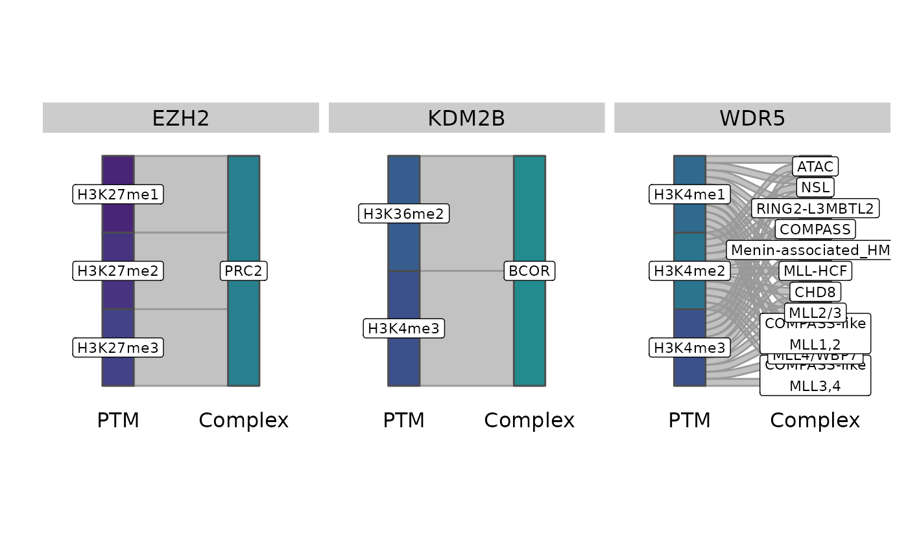

### 5.2 Python visualization

Finally, we create an interactive network using Python via the
`reticulate` package. This allows a dynamic visualization that can be
refined and filtered to generate different views.

``` r

net_edges_py <- r_to_py(net_created$net_edges)
net_vertices_py <- r_to_py(net_created$net_vertices)
```

``` python
import pandas as pd, networkx as nx
from pyvis.network import Network
# Create NetworkX graph object
G = nx.Graph()

# Generate a nested dictionary/tuple with the node of interest ("Symbol") and 
# the relevant attributes (shape and complex)
node_list = []
for i, row in r.net_vertices_py.iterrows():
  node_list.append((row["Symbol"], {"color": {"background": row.Colors, "border": row.Border}, "Complex": row.Complex, "shape": row.Shapes}))
G.add_nodes_from(node_list)

# Generate a tuple for edges connecting proteins with PTMs
edge_tup = []
for i in range(len(r.net_edges_py["Symbol"])):
  edge_tup.append((r.net_edges_py["Symbol"][i], r.net_edges_py["PTM"][i]))
G.add_edges_from(edge_tup)

# Remove self-loops
G.remove_edges_from(nx.selfloop_edges(G))

# Now remove nodes without edges
lone_nodes = [node for node, degree in G.degree() if degree == 0]
G.remove_nodes_from(lone_nodes)
# To change the parameters of what's being graphed, adjust the initial call to Network()
net = Network(height="900px", notebook = True, select_menu = True, cdn_resources = "in_line")
net.from_nx(G)
net.save_graph("networkx-pyvis-BCG.html")
```

``` r

htmltools::renderDocument(htmltools::htmlTemplate("networkx-pyvis-BCG.html"))
```

## 

## 

Select a Node by ID H3K4me1 WDR5 H3K4me2 H3K4me3 KDM2B H3K27me1 EZH2
H3K27me2 H3K36me2 H3K27me3

Reset Selection

### 5.3 Minimal network

``` r

# This value (and selected metric) can be adjusted to fit the data
histone_single_p <- filter(histone_single, `P_unadj` < 0.2)

# Now making a network with a subset of histones, as well as
# proteome/phosphoproteome peptides that meet the FDR-adjusted threshold
net_created_hp <- multi_net(genes_df = genes, total_df = THP1_total_sig,
          phospho_df = THP1_phospho_sig, symbol_col = "Symbol", fc_col = "log2(FC)",
          epi_single_df = histone_single_p,
          epi_symbol_col = "PTM", epi_fc_col = "log2(FC)")
#> Joining with `by = join_by(`HGNC approved symbol`, `UniProt ID (human)`,
#> Function, Modification, `Protein complex`, `Target entity`, Product,
#> `log2(FC)`, Source)`
net_created_hp$grid
```

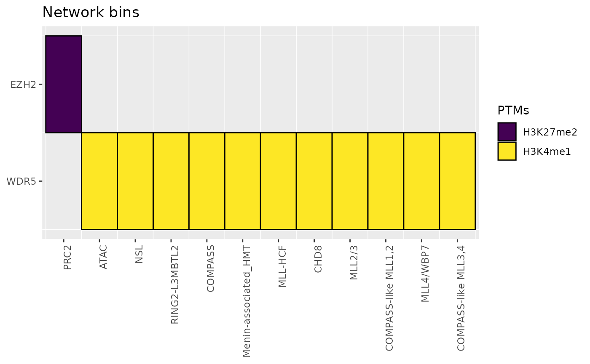

``` r

net_created_hp$complex_list
#>  [1] "ATAC"                 "BAF"                  "BCOR"                
#>  [4] "BRCA1-A"              "BRCC"                 "CAF-1"               
#>  [7] "CHD8"                 "COMPASS"              "COMPASS-like MLL1,2" 
#> [10] "COMPASS-like MLL3,4"  "Menin-associated_HMT" "MLL-HCF"             
#> [13] "MLL2/3"               "MLL4/WBP7"            "nBAF"                
#> [16] "npBAF"                "NSL"                  "NuA4"                
#> [19] "PBAF"                 "PR-DUB"               "PRC1"                
#> [22] "PRC2"                 "RING2-FBRS"           "RING2-L3MBTL2"       
#> [25] "SWI/SNF BRM-BRG1"     "SWI/SNF-like EPAFB"   "SWI/SNF-like_EPAFa"  
#> [28] "WINAC"
net_created_hp$member_list
#>                 Complex                                Members
#> 1                                                             
#> 2                  ATAC                                   WDR5
#> 3                   BAF                                 ARID1B
#> 4                  BCOR                           KDM2B, RING1
#> 5               BRCA1-A                                  BARD1
#> 6                  BRCC                                  BARD1
#> 7                 CAF-1                                 CHAF1B
#> 8                  CHD8        CHD8, KANSL1, MEN1, SENP3, WDR5
#> 9               COMPASS                                   WDR5
#> 10  COMPASS-like MLL1,2                      KMT2D, MEN1, WDR5
#> 11  COMPASS-like MLL3,4                            KMT2D, WDR5
#> 12 Menin-associated_HMT                             MEN1, WDR5
#> 13              MLL-HCF                             MEN1, WDR5
#> 14               MLL2/3        CHD8, KANSL1, MEN1, SENP3, WDR5
#> 15            MLL4/WBP7 CHD8, KANSL1, KMT2D, MEN1, SENP3, WDR5
#> 16                 nBAF                                 ARID1B
#> 17                npBAF                                 ARID1B
#> 18                  NSL              KANSL1, KANSL3, OGT, WDR5
#> 19                 NuA4                                MORF4L1
#> 20                 PBAF                                 ARID1B
#> 21               PR-DUB                                  ASXL1
#> 22                 PRC1                                  RING1
#> 23                 PRC2                                   EZH2
#> 24           RING2-FBRS                                  RING1
#> 25        RING2-L3MBTL2                   L3MBTL2, RING1, WDR5
#> 26     SWI/SNF BRM-BRG1                           ARID1B, BRD9
#> 27   SWI/SNF-like EPAFB                                 ARID1B
#> 28   SWI/SNF-like_EPAFa                                 ARID1B
#> 29                WINAC                                 CHAF1B
#>                                                                       PTMs
#> 1                                                                         
#> 2                                          H3K4, H3K4me1, H3K4me2, H3K4me3
#> 3                                                                  H2BK120
#> 4                       H3K4me3, H3K4, H3K36, H3K36me2, H2AK119, H2AK119ub
#> 5                 H2AX, H2AXub, H2Aub, H2Bub, H3ub, H4ub, H2A, H2B, H3, H4
#> 6                 H2AX, H2AXub, H2Aub, H2Bub, H3ub, H4ub, H2A, H2B, H3, H4
#> 7                                                                   H3, H4
#> 8          H1, H4, H4ac, H3K4, H3K4me, H3, H3ac, H3K4me1, H3K4me2, H3K4me3
#> 9                                          H3K4, H3K4me1, H3K4me2, H3K4me3
#> 10                                 H3K4, H3K4me, H3K4me1, H3K4me2, H3K4me3
#> 11                                 H3K4, H3K4me, H3K4me1, H3K4me2, H3K4me3
#> 12                                 H3K4, H3K4me, H3K4me1, H3K4me2, H3K4me3
#> 13                                 H3K4, H3K4me, H3K4me1, H3K4me2, H3K4me3
#> 14         H1, H4, H4ac, H3K4, H3K4me, H3, H3ac, H3K4me1, H3K4me2, H3K4me3
#> 15         H1, H4, H4ac, H3K4, H3K4me, H3, H3ac, H3K4me1, H3K4me2, H3K4me3
#> 16                                                                 H2BK120
#> 17                                                                 H2BK120
#> 18    H4, H4ac, H6, H2BS112, H2BS112GlcNa, H3K4, H3K4me1, H3K4me2, H3K4me3
#> 19                                                                      H4
#> 20                                                                 H2BK120
#> 21                                                     H2AK119, H2AK119ub1
#> 22                                                      H2AK119, H2AK119ub
#> 23                                     H3K27, H3K27me1, H3K27me2, H3K27me3
#> 24                                                      H2AK119, H2AK119ub
#> 25 H3K4, H3K9, H3K27, H4K20, H2AK119, H2AK119ub, H3K4me1, H3K4me2, H3K4me3
#> 26                                                             H2BK120, H3
#> 27                                                                 H2BK120
#> 28                                                                 H2BK120
#> 29                                                                  H3, H4
net_created_hp$gene_list
#> # A tibble: 18 × 6
#>    `HGNC approved symbol` Function                Modification `Protein complex`
#>    <chr>                  <chr>                   <chr>        <chr>            
#>  1 ARID1B                 Histone modification w… Histone ubi… BAF, nBAF, npBAF…
#>  2 ASXL1                  Histone modification e… Histone deu… PR-DUB           
#>  3 BARD1                  Histone modification w… Histone ubi… BRCC, BRCA1-A    
#>  4 BRD9                   Histone modification r… #            SWI/SNF BRM-BRG1 
#>  5 CHAF1B                 Chromatin remodeling    #            WINAC, CAF-1     
#>  6 CHD8                   Chromatin remodeling    #            CHD8, MLL2/3, ML…
#>  7 EZH2                   Histone modification w… Histone met… PRC2             
#>  8 KANSL1                 Histone modification w… Histone met… NSL, CHD8, MLL2/…
#>  9 KANSL3                 Histone modification w… Histone ace… NSL              
#> 10 KDM2B                  Histone modification e… Histone met… BCOR             
#> 11 KMT2D                  Histone modification w… Histone met… COMPASS-like MLL…
#> 12 L3MBTL2                Histone modification r… #            RING2-L3MBTL2    
#> 13 MEN1                   Histone modification w… Histone met… Menin-associated…
#> 14 MORF4L1                Histone modification r… #            NuA4             
#> 15 OGT                    Histone modification w… Histone Glc… NSL              
#> 16 RING1                  Histone modification w… Histone ubi… PRC1, BCOR, RING…
#> 17 SENP3                  Histone modification e… Histone sum… CHD8, MLL2/3, ML…
#> 18 WDR5                   Histone modification r… #            ATAC, NSL, RING2…
#> # ℹ 2 more variables: `Target entity` <chr>, Product <chr>
net_created_hp$PTM_list
#>             PTM Differential expression
#> 1       H2BK120                    Down
#> 2       H2AK119                    Down
#> 3    H2AK119ub1                    Down
#> 4          H2AX                    Down
#> 5        H2AXub                    Down
#> 6         H2Aub                    Down
#> 7         H2Bub                    Down
#> 8          H3ub                    Down
#> 9          H4ub                    Down
#> 10          H2A                    Down
#> 11          H2B                    Down
#> 12           H3                    Down
#> 13           H4                    Down
#> 14           H1                    Down
#> 15        H3K27                    Down
#> 16     H3K27me1                    Down
#> 17     H3K27me2                    Down
#> 18     H3K27me3                    Down
#> 19         H4ac                    Down
#> 20           H6                    Down
#> 21      H3K4me3                    Down
#> 22         H3K4                    Down
#> 23        H3K36                    Down
#> 24     H3K36me2                    Down
#> 25       H3K4me                    Down
#> 26         H3K9                    Down
#> 27        H4K20                    Down
#> 28         H3K4                      Up
#> 29       H3K4me                      Up
#> 30           H4                      Up
#> 31      H2BS112                      Up
#> 32 H2BS112GlcNa                      Up
#> 33    H2AK119ub                    Down
#> 34         H3ac                    Down
#> 35      H3K4me1                      Up
#> 36      H3K4me2                      Up
#> 37      H3K4me3                      Up
```

``` r

# Getting a dataframe with the network members
sn_df_hp <- net_created_hp$ts

# Creating two tables (centered on protein, then centered on histone PTMs) with
# more descriptive information
sn_collapsed_gene_hp <- sn_df_hp %>%
  group_by(Symbol, `log2(FC)_gene`, `P value`) %>%
  summarize(Source = paste(unique(Source), collapse = ", "), PTMs = paste(unique(PTM), collapse = ", "), Complexes = paste(unique(Complex), collapse = ", ")) %>% 
  rename("log2(FC)_gene" = "log2(FC) (gene)")
#> `summarise()` has regrouped the output.
#> ℹ Summaries were computed grouped by Symbol, log2(FC)_gene, and P value.
#> ℹ Output is grouped by Symbol and log2(FC)_gene.
#> ℹ Use `summarise(.groups = "drop_last")` to silence this message.
#> ℹ Use `summarise(.by = c(Symbol, log2(FC)_gene, P value))` for per-operation
#>   grouping (`?dplyr::dplyr_by`) instead.
knitr::kable(sn_collapsed_gene_hp)
```

| Symbol | log2(FC) (gene) | P value | Source | PTMs | Complexes |
|:---|---:|---:|:---|:---|:---|
| EZH2 | -1.8497518 | 0.2810525 | Phospho | H3K27me2 | PRC2 |
| WDR5 | 0.3132723 | 0.3938377 | Phospho | H3K4me1 | ATAC, NSL, RING2-L3MBTL2, COMPASS, Menin-associated_HMT, MLL-HCF, CHD8, MLL2/3, COMPASS-like MLL1,2, MLL4/WBP7, COMPASS-like MLL3,4 |

``` r


sn_collapsed_PTM_hp <- sn_df_hp %>%
  group_by(PTM, `log2(FC)_hist`) %>%
  summarize(Genes = paste(unique(Symbol), collapse = ", "), Complexes = paste(unique(Complex), collapse = ", ")) %>% 
  rename("log2(FC)_hist" = "log2(FC) (PTM)")
#> `summarise()` has regrouped the output.
#> ℹ Summaries were computed grouped by PTM and log2(FC)_hist.
#> ℹ Output is grouped by PTM.
#> ℹ Use `summarise(.groups = "drop_last")` to silence this message.
#> ℹ Use `summarise(.by = c(PTM, log2(FC)_hist))` for per-operation grouping
#>   (`?dplyr::dplyr_by`) instead.
knitr::kable(sn_collapsed_PTM_hp)
```

| PTM | log2(FC) (PTM) | Genes | Complexes |
|:---|---:|:---|:---|
| H3K27me2 | -0.0831630 | EZH2 | PRC2 |
| H3K4me1 | 0.0010933 | WDR5 | ATAC, NSL, RING2-L3MBTL2, COMPASS, Menin-associated_HMT, MLL-HCF, CHD8, MLL2/3, COMPASS-like MLL1,2, MLL4/WBP7, COMPASS-like MLL3,4 |

``` r

# Creating a Sankey flow diagram for an alternate representation
# of how complexes, PTMs, and members are connected
sankey_sn_hp <- sn_df_hp
sankey_sn_hp$Complex <- str_wrap(sankey_sn_hp$Complex, 10)
node_names_hp <- unique(c(sankey_sn_hp$PTM, unique(sankey_sn_hp$Complex)))

v_pal_res_hp <- (viridis_pal(begin = 0.1, option = "D")(length(node_names_hp)))
names(v_pal_res_hp) <- node_names_hp

link_pal_hp <- rep("gray60", times = length(unique(sankey_sn_hp$Symbol)))
names(link_pal_hp) <- unique(sankey_sn_hp$Symbol)

SankeyPlot(arrange(sankey_sn_hp, PTM), x = c("PTM", "Complex"), in_form = "wide",
           links_fill_by = "Symbol", nodes_label = TRUE, xlab = "", ylab = "",
           expand = c(0.1, 0.6), facet_by = "Symbol", facet_scales = "free_y",
           aspect.ratio = 1, facet_ncol = 4, theme_args = list(strip.background = ggplot2::element_rect(fill="grey80")), nodes_legend = "separate",
           links_palcolor = link_pal_hp, links_color = ".fill",
           nodes_palcolor = v_pal_res_hp) +
  theme(legend.position = "none", axis.text.y = element_blank(), axis.ticks.y = element_blank())
```

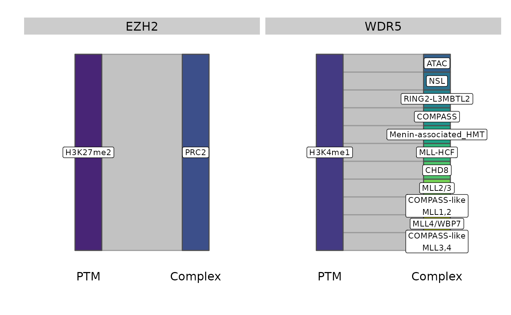

``` r

net_edges_py_hp <- r_to_py(net_created_hp$net_edges)
net_vertices_py_hp <- r_to_py(net_created_hp$net_vertices)
```

``` python
import pandas as pd, networkx as nx
from pyvis.network import Network
# Create NetworkX graph object
G2 = nx.Graph()

# Generate a nested dictionary/tuple with the node of interest ("Symbol") and 
# the relevant attributes (shape and complex)
node_list_hp = []
for i, row in r.net_vertices_py_hp.iterrows():
  node_list_hp.append((row["Symbol"], {"color": {"background": row.Colors, "border": row.Border}, "Complex": row.Complex, "shape": row.Shapes}))
G2.add_nodes_from(node_list_hp)

# Generate a tuple for edges connecting proteins with PTMs
edge_tup_hp = []
for i in range(len(r.net_edges_py_hp["Symbol"])):
  edge_tup_hp.append((r.net_edges_py_hp["Symbol"][i], r.net_edges_py_hp["PTM"][i]))
G2.add_edges_from(edge_tup_hp)

# Remove self-loops
G2.remove_edges_from(nx.selfloop_edges(G2))

# Now remove nodes without edges
lone_nodes_hp = [node for node, degree in G2.degree() if degree == 0]
G2.remove_nodes_from(lone_nodes_hp)
# To change the parameters of what's being graphed, adjust the initial call to Network()
net2 = Network(height="900px", notebook = True, select_menu = True, cdn_resources = "in_line")
net2.from_nx(G2)
net2.save_graph("networkx-pyvis-BCG2.html")
```

``` r

htmltools::renderDocument(htmltools::htmlTemplate("networkx-pyvis-BCG2.html"))
```

## 

## 

Select a Node by ID H3K4me1 WDR5 H3K27me2 EZH2

Reset Selection

Choudhary, Eira, C. Korin Bullen, Renu Goel, et al. 2020. “Relative and
Quantitative Phosphoproteome Analysis of Macrophages in Response to
Infection by Virulent and Avirulent Mycobacteria Reveals a Distinct Role
of the Cytosolic RNA Sensor RIG-i in Mycobacterium Tuberculosis
Pathogenesis.” *Journal of Proteome Research* 19 (6): 2316–36.
<https://doi.org/10.1021/acs.jproteome.9b00895>.

Schaefer, Zoe, John Iradukunda, Evelyn N. Lumngwena, Kari B. Basso,
Jonathan M. Blackburn, and Ivana K. Parker. 2024. “Multilevel Proteomics
Reveals Epigenetic Signatures in BCG-Mediated Macrophage Activation.”
*Molecular & Cellular Proteomics* 23 (11): 100851.
<https://doi.org/10.1016/j.mcpro.2024.100851>.

Yuan, Zuo-Fei, Simone Sidoli, Dylan M. Marchione, et al. 2018.
“EpiProfile 2.0: A Computational Platform for Processing Epi-Proteomics
Mass Spectrometry Data.” *Journal of Proteome Research* 17 (7): 2533–41.
<https://doi.org/10.1021/acs.jproteome.8b00133>.
