# MCF7 case

This pipeline is intended for use with three levels of proteomics data:
total proteome, phosphoproteome, and histone proteome. Total and
phosphoproteome data are sourced from Han et al. (2024). Total and
phosphoproteome data are designed to be input as an Excel sheet from
MaxQuant, and the histone data are derived from LeRoy et al. (2013).

The full R Markdown source document can be downloaded from this page by
clicking the Source link above. Additionally, we have made available the
files generated from our data at the project repository on Github. Other
files can be downloaded from their respective sources.

Most variables that need to be adjusted for individual datasets should
be set here.

``` r

total_p_threshold <- 0.05
total_FC_threshold <- 0.5
phospho_p_threshold <- 0.05
phospho_FC_threshold <- 0.5
histone_p_threshold <- 0.05
histone_FC_threshold <- 0.5
```

If you have not previously set up a Python environment from RStudio, run
this chunk.

``` r

virtualenv_create("r-reticulate")
#> virtualenv: r-reticulate
use_virtualenv("r-reticulate")
virtualenv_install("r-reticulate", c("pandas", "networkx", "pyvis"), action = "add")
#> Using virtual environment 'r-reticulate' ...
#> + /home/runner/.virtualenvs/r-reticulate/bin/python -m pip install --upgrade --no-user pandas networkx pyvis
```

## 1. Proteome data processing

This section prepares proteome data. For data other than the example,
read in the data in place of the
[`data()`](https://rdrr.io/r/utils/data.html) call.

``` r

data(MCF7_total)
# Renaming to reader-friendly names not necessary here
# Mapping ENTREZ and UNIPROT IDs already done
# Dropping anything with an undefined or duplicate symbol
MCF7_total <- MCF7_total %>%
  tidyr::drop_na(SYMBOL2) %>%
  dplyr::distinct(SYMBOL2, .keep_all = TRUE) %>% 
  dplyr::rename("Symbol" = "SYMBOL2")
# Assigning row names already done
# Calculating Storey's q-value for FDR estimation
MCF7_total$`Q value` <- qvalue(MCF7_total$`P value`)$qvalues

# Creating a separate set of significant points for later analysis
MCF7_total_sig <- dplyr::filter(MCF7_total, `Q value` < total_p_threshold)
MCF7_total_sig_unadj <- dplyr::filter(MCF7_total, `P value` < total_p_threshold)
```

### 1.1. Volcano plots

Here we create several volcano plots to show the data.

``` r

# Setting this value - geom_text_repel will only show so many labels at once
# for legibility reasons. Adjust this threshold to show more/fewer points.
options("ggrepel.max.overlaps" = 20)

volcanoplot(df = MCF7_total, fc_col = "log2(FC)",
            p_col = "Q value", label_col = "Symbol") +
  ggtitle("Volcano plot") + xlab("log2(FC)") + ylab("-log10(Q-value)")
```

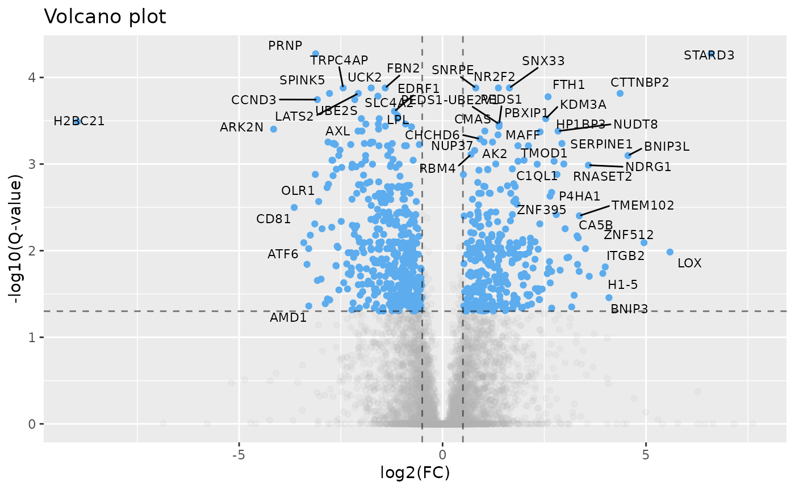

If you have known proteins of interest, use
[`volcano_groups()`](https://zoe-schaefer.github.io/MPOInt/reference/volcano_groups.md)
to highlight them on a graph.

``` r

# For known groups of interest
# Setting this value - geom_text_repel will only show so many labels at once
# for legibility reasons. Adjust this threshold to show more/fewer points.
options("ggrepel.max.overlaps" = 20)
volcano_groups(df = MCF7_total, fc_col = "log2(FC)", p_col = "Q value", label_col = "Symbol",
  group_list = list("Group 1: Chromatin" = c("KMT2A", "H1-5", "H2BC21", "EP400", "RBBP6", "KDM4B", "CHD6"), "Group 2: ERBC" = c("RUNX1", "PTEN", "MAP3K1", "CCND1", "MYC", "AHNAK2", "IL20RA", "CCNB1", "EIF4EBP2", "PTGFRN", "PRKDC", "TBL1XR1", "CDKN1B", "SF3B5"))) +
  scale_color_manual(values = c("Group 1: Chromatin" = "red", "Group 2: ERBC" = "blue", "None" = "gray")) +
  ggtitle("Grouped volcano plot") + xlab("log2FC") + ylab("-log10(Q-value)")
```

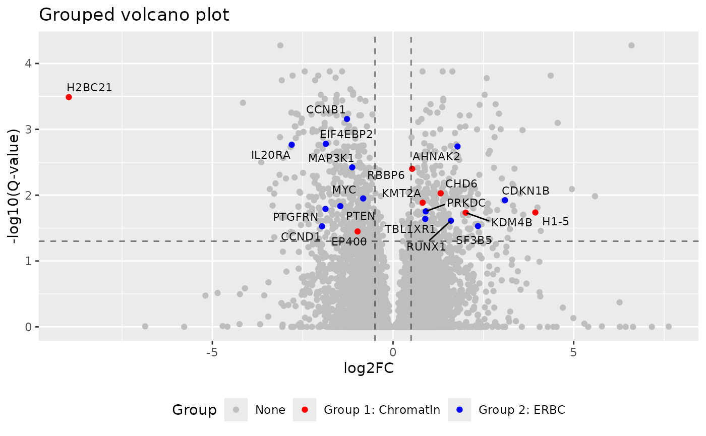

### 1.2. GSEA

This section prepares and performs a GSEA analysis on the total proteome
data.

``` r

# Need a named list in decreasing order
total_GSEA_list <- MCF7_total$`log2(FC)`
names(total_GSEA_list) <- MCF7_total$ENTREZID
total_GSEA_list <- na.omit(total_GSEA_list)
total_GSEA_list <- sort(total_GSEA_list, decreasing = TRUE)
```

``` r

total_GSEA_GO <- gseGO(geneList = total_GSEA_list, OrgDb = "org.Hs.eg.db",
                    verbose = FALSE, ont = "ALL")
#> Warning in prepare_gsea_inputs(geneList, scoreType, exponent): There are ties
#> in the preranked stats (0.66% of the list). The order of those tied genes will
#> be arbitrary, which may produce unexpected results.
#> Warning in gsea(geneList = geneList, gene_sets = geneSets, minGSSize =
#> minGSSize, : There were 109 pathways for which P-values were not calculated
#> properly due to unbalanced gene-level statistic values. For such pathways
#> pvalue, NES and log2err are set to NA. You can try to increase nPermSimple.
#> Warning in calculate_qvalue(gsea_res$pvalue): Invalid p-values detected (NA,
#> non-finite, <0, or >1). qvalue will be computed on valid p-values only.
#> Warning in enrichit::gsea_gson(geneList = geneList, exponent = exponent, : NA
#> values detected in gene set IDs. Replacing with string 'NA'.
#> Warning in enrichit::gsea_gson(geneList = geneList, exponent = exponent, :
#> Duplicate gene set IDs detected: NA... (Total 1). Unique suffixes added.
# By visual inspection of graphs, this contained redundant terms - use simplify() to reduce if desired
# simple_total_GSEA_GO <- clusterProfiler::simplify(total_GSEA_GO)
total_GSEA_KEGG <- gseKEGG(geneList = total_GSEA_list, verbose = FALSE)
#> Reading KEGG annotation online: "https://rest.kegg.jp/link/hsa/pathway"...
#> Reading KEGG annotation online: "https://rest.kegg.jp/list/pathway/hsa"...
#> Warning in prepare_gsea_inputs(geneList, scoreType, exponent): There are ties
#> in the preranked stats (0.66% of the list). The order of those tied genes will
#> be arbitrary, which may produce unexpected results.
#> Warning in gsea(geneList = geneList, gene_sets = geneSets, minGSSize =
#> minGSSize, : There were 2 pathways for which P-values were not calculated
#> properly due to unbalanced gene-level statistic values. For such pathways
#> pvalue, NES and log2err are set to NA. You can try to increase nPermSimple.
#> Warning in calculate_qvalue(gsea_res$pvalue): Invalid p-values detected (NA,
#> non-finite, <0, or >1). qvalue will be computed on valid p-values only.
#> Warning in enrichit::gsea_gson(geneList = geneList, exponent = exponent, : NA
#> values detected in gene set IDs. Replacing with string 'NA'.
#> Warning in enrichit::gsea_gson(geneList = geneList, exponent = exponent, :
#> Duplicate gene set IDs detected: NA... (Total 1). Unique suffixes added.
```

Plotting GSEA dot plots can be difficult due to the volume of
information included. Changing the value of `label_format` adjusts the
label wrapping, which can help crowded figures.

``` r

if (nrow(total_GSEA_GO@result) > 0) {
  dotplot(total_GSEA_GO, showCategory = 20, font.size = rel(0.8), label_format = 40, title = "GO enrichment",
          split = "ONTOLOGY") + facet_wrap(ONTOLOGY~.sign, scales = "free_y", ncol = 2)
} else {
  print("Error: no terms enriched under P-value cutoff (total_GSEA_GO)")
}
```

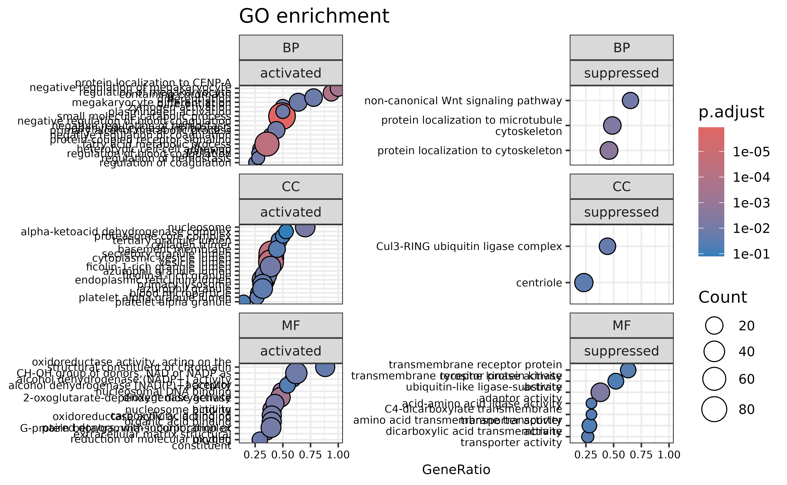

``` r


if (nrow(total_GSEA_KEGG@result) > 0) {
  dotplot(total_GSEA_KEGG, showCategory = 20, font.size = rel(1), label_format = 40, title = "KEGG enrichment",
          split = ".sign") + facet_wrap(.~.sign)
} else {
  print("Error: no terms enriched under P-value cutoff (total_GSEA_KEGG)")
}
```

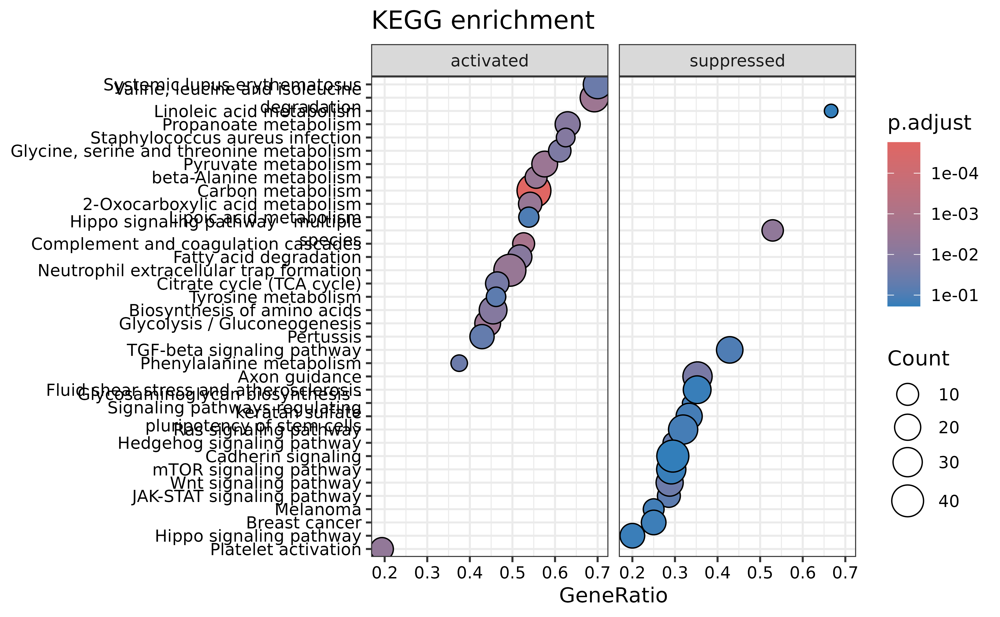

``` r

# Clearing large variables
rm(total_GSEA_GO, total_GSEA_KEGG, total_GSEA_list, MCF7_total)
```

## 2. Phosphoproteome data processing

Similar to the previous section, this prepares phosphoproteome data.

``` r

# Renaming to reader-friendly names not necessary here
data(MCF7_phospho)
# Mapping ENTREZ IDs and a gene symbol column to UniProt IDs for later analysis
MCF7_phospho <- dplyr::left_join(MCF7_phospho, OrganismDbi::select(
  Homo.sapiens::Homo.sapiens,
  keys = OrganismDbi::keys(Homo.sapiens::Homo.sapiens, keytype = "ENTREZID"),
  columns = c("UNIPROT", "SYMBOL"), keytype = "ENTREZID"
), by = dplyr::join_by(SYMBOL2 == SYMBOL, ENTREZID), keep = FALSE, relationship = "many-to-many")
#> 'select()' returned 1:many mapping between keys and columns
# Dropping anything with an undefined or duplicate symbol
MCF7_phospho <- MCF7_phospho %>%
  tidyr::drop_na(SYMBOL2) %>%
  dplyr::distinct(SYMBOL2, .keep_all = TRUE)
# Assigning row names
MCF7_phospho <- MCF7_phospho %>%
  dplyr::mutate("SYMBOL" = `SYMBOL2`) %>%
  tibble::column_to_rownames(var = "SYMBOL") %>% 
  dplyr::rename("Symbol" = "SYMBOL2")
# Calculating Storey's q-value for FDR estimation
MCF7_phospho$`Q value` <- qvalue(MCF7_phospho$`P value`)$qvalues

# Creating a separate set of significant points for later analysis
MCF7_phospho_sig <- dplyr::filter(MCF7_phospho, `Q value` < phospho_p_threshold)
MCF7_phospho_sig_unadj <- dplyr::filter(MCF7_phospho, `P value` < phospho_p_threshold)
```

### 2.1. Volcano plots

``` r

# Setting this value - geom_text_repel will only show so many labels at once
# for legibility reasons. Adjust this threshold to show more/fewer points.
options("ggrepel.max.overlaps" = 20)

volcanoplot(df = MCF7_phospho, fc_col = "log2(FC)",
            p_col = "Q value", label_col = "Symbol") +
  ggtitle("Volcano plot") + xlab("log2(FC)") + ylab("-log10(Q-value)")
```

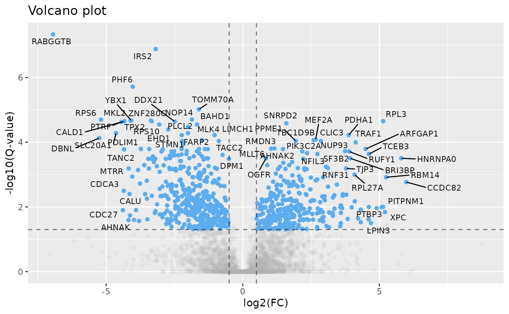

``` r

# For known groups of interest
volcano_groups(df = MCF7_phospho, fc_col = "log2(FC)", p_col = "Q value", label_col = "Symbol",
  group_list = list("Group 1: Chromatin" = c("ASH2L", "SAP130", "REST", "CHD4", "EED", "KDM4A", "KDM1A", "RBBP4", "HIST1H4A", "KAT7", "SMARCAD1"), "Group 2: ERBC" = c("CDK1", "GATAD2B", "AKT2", "PARP1", "XRCC6", "AHNAK", "MAPK1"))) +
  scale_color_manual(values = c("Group 1: Chromatin" = "red", "Group 2: ERBC" = "blue", "None" = "gray")) +
  ggtitle("Grouped volcano plot") + xlab("log2FC") + ylab("-log10(Q-value)")
```

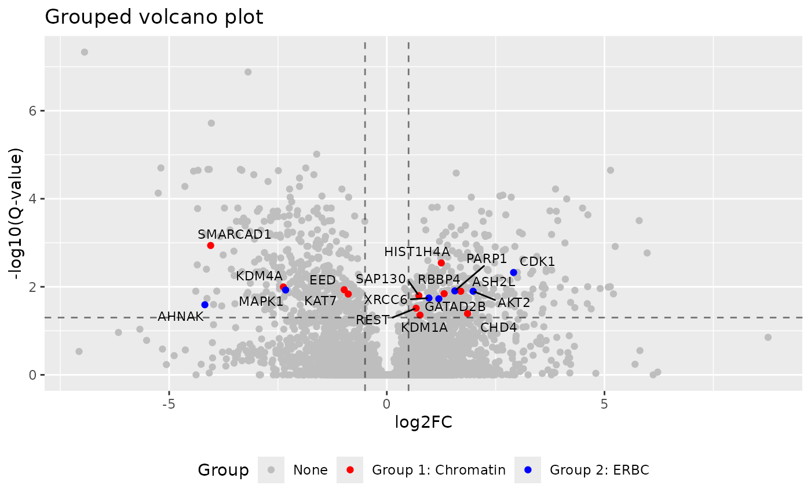

### 2.2. GSEA

``` r

# Need a named list in decreasing order
MCF7_phospho <- drop_na(MCF7_phospho, ENTREZID) %>% distinct(ENTREZID, .keep_all = TRUE)
phospho_GSEA_list <- MCF7_phospho$`log2(FC)`
names(phospho_GSEA_list) <- MCF7_phospho$ENTREZID
phospho_GSEA_list <- sort(phospho_GSEA_list, decreasing = TRUE)
```

``` r

phospho_GSEA_GO <- gseGO(geneList = phospho_GSEA_list, OrgDb = "org.Hs.eg.db",
                    verbose = FALSE, ont = "ALL")
#> Warning in gsea(geneList = geneList, gene_sets = geneSets, minGSSize =
#> minGSSize, : There were 426 pathways for which P-values were not calculated
#> properly due to unbalanced gene-level statistic values. For such pathways
#> pvalue, NES and log2err are set to NA. You can try to increase nPermSimple.
#> Warning in calculate_qvalue(gsea_res$pvalue): Invalid p-values detected (NA,
#> non-finite, <0, or >1). qvalue will be computed on valid p-values only.
#> Warning in enrichit::gsea_gson(geneList = geneList, exponent = exponent, : NA
#> values detected in gene set IDs. Replacing with string 'NA'.
#> Warning in enrichit::gsea_gson(geneList = geneList, exponent = exponent, :
#> Duplicate gene set IDs detected: NA... (Total 1). Unique suffixes added.
phospho_GSEA_KEGG <- gseKEGG(geneList = phospho_GSEA_list, verbose = FALSE)
#> Warning in gsea(geneList = geneList, gene_sets = geneSets, minGSSize =
#> minGSSize, : There were 13 pathways for which P-values were not calculated
#> properly due to unbalanced gene-level statistic values. For such pathways
#> pvalue, NES and log2err are set to NA. You can try to increase nPermSimple.
#> Warning in calculate_qvalue(gsea_res$pvalue): Invalid p-values detected (NA,
#> non-finite, <0, or >1). qvalue will be computed on valid p-values only.
#> Warning in enrichit::gsea_gson(geneList = geneList, exponent = exponent, : NA
#> values detected in gene set IDs. Replacing with string 'NA'.
#> Warning in enrichit::gsea_gson(geneList = geneList, exponent = exponent, :
#> Duplicate gene set IDs detected: NA... (Total 1). Unique suffixes added.
```

``` r

if (nrow(phospho_GSEA_GO@result) > 0) {
  dotplot(phospho_GSEA_GO, showCategory = 20, font.size = rel(1), label_format = 50, title = "GO enrichment",
          split = "ONTOLOGY") + facet_wrap(ONTOLOGY~.sign, scales = "free_y", ncol = 2)
} else {
  print("Error: no terms enriched under P-value cutoff (phospho_GSEA_GO)")
}
```

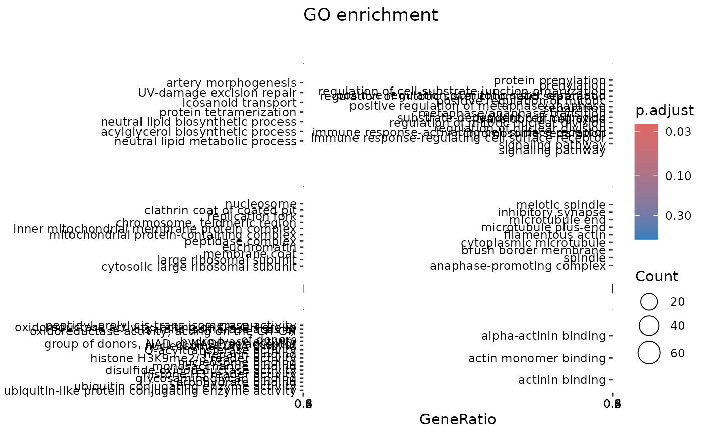

``` r


if (nrow(phospho_GSEA_KEGG@result) > 0) {
  dotplot(phospho_GSEA_KEGG, showCategory = 20, font.size = rel(1), label_format = 40, title = "KEGG enrichment",
          split = ".sign") + facet_wrap(.~.sign, scales = "free", ncol = 2)
} else {
  print("Error: no terms enriched under P-value cutoff (phospho_GSEA_KEGG)")
}
```

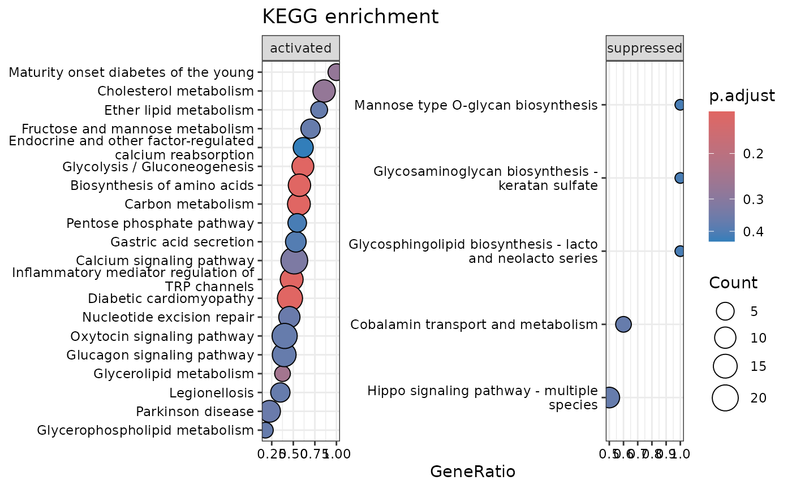

``` r

# Clearing large variables
rm(phospho_GSEA_GO, phospho_GSEA_KEGG,
   phospho_GSEA_list, MCF7_phospho)
```

## 3. Histone processing

This section processes EpiProfile output into a more readable,
user-friendly format. In this case, the epiproteome data is in a summary
statistics format, where each condition is only presented as a mean
value with standard deviation. We create a standard baseline and then
generate a P value from a T score.

``` r

data(MCF7_histones)
MCF7_histones <- dplyr::select(MCF7_histones, c("PTM", "MCF7 ave (5 reps)", "293 ave (5 reps)", "HaCAT ave (5 reps)", "hESC ave (6 reps)", "HFF ave (7 reps)", "Mdm13 ave (5 reps)", "MCF7 std"))
histone_single_raw <- clean_names(MCF7_histones, "PTM")[[1]]
histone_frag_raw <- clean_names(MCF7_histones, "PTM")[[2]]
```

### 3.1. Fragments

The data available here was already in a legible format, so we do not
have to process it extensively.

``` r

histone_frag <- histone_summary(df = histone_frag_raw, label_col = "PTM", base_cols = c("293 ave (5 reps)", "HaCAT ave (5 reps)", "hESC ave (6 reps)", "HFF ave (7 reps)", "Mdm13 ave (5 reps)"), base_std = NA, target_col = "MCF7 ave (5 reps)", target_std = "MCF7 std")
```

``` r

# Setting this value - geom_text_repel will only show so many labels at once
# for legibility reasons. Adjust this threshold to show more/fewer points.
options("ggrepel.max.overlaps" = 7)

volcano_epi(df = histone_frag, fc_col = "log2(FC)",
            p_col = "P_adj", label_col = "PTM") +
  labs(title = "Volcano plot", x = "log2(FC)", y = "-log10(P-value)")
#> Joining with `by = join_by(PTM, `293 ave (5 reps)`, `HaCAT ave (5 reps)`, `hESC
#> ave (6 reps)`, `HFF ave (7 reps)`, `Mdm13 ave (5 reps)`, target_col,
#> target_std, base_avg, base_std, `log2(FC)`, `T score`, `P value`, P_unadj,
#> P_adj, x_col, p_raw, p_log10, DiffExp, labels)`
```

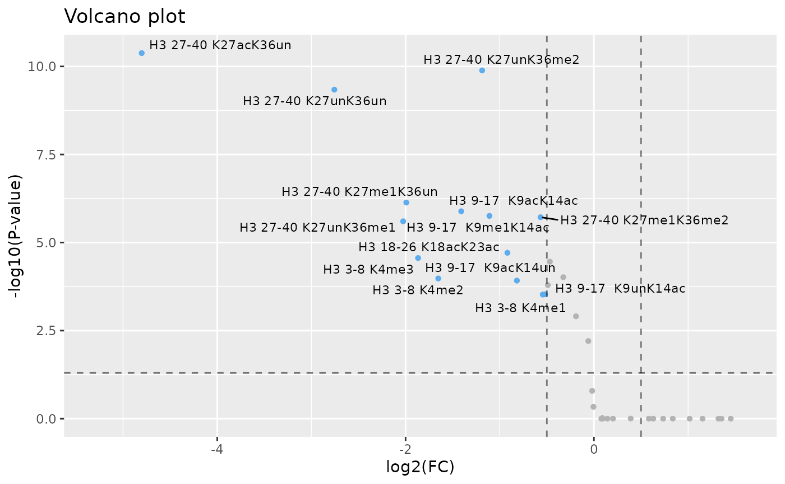

### 3.2. Single

This section parses the fragments into single PTMs. Each occurrence is
counted individually - for example, H4 4-17 K5acK12acK16ac would be
counted as H4K5ac, H4K8ac, and H4K16ac.

``` r

histone_single <- histone_summary(df = histone_single_raw, label_col = "PTM", base_cols = c("293 ave (5 reps)", "HaCAT ave (5 reps)", "hESC ave (6 reps)", "HFF ave (7 reps)", "Mdm13 ave (5 reps)"), base_std = NA, target_col = "MCF7 ave (5 reps)", target_std = "MCF7 std")
```

``` r

# Setting this value - geom_text_repel will only show so many labels at once
# for legibility reasons. Adjust this threshold to show more/fewer points.
options("ggrepel.max.overlaps" = 20)

volcano_epi(df = histone_single, fc_col = "log2(FC)",
            p_col = "P_adj", label_col = "PTM") +
  labs(title = "Volcano plot", x = "log2(FC)", y = "-log10(P-value)")
#> Joining with `by = join_by(PTM, `293 ave (5 reps)`, `HaCAT ave (5 reps)`, `hESC
#> ave (6 reps)`, `HFF ave (7 reps)`, `Mdm13 ave (5 reps)`, target_col,
#> target_std, base_avg, base_std, `log2(FC)`, `T score`, `P value`, P_unadj,
#> P_adj, x_col, p_raw, p_log10, DiffExp, labels)`
```

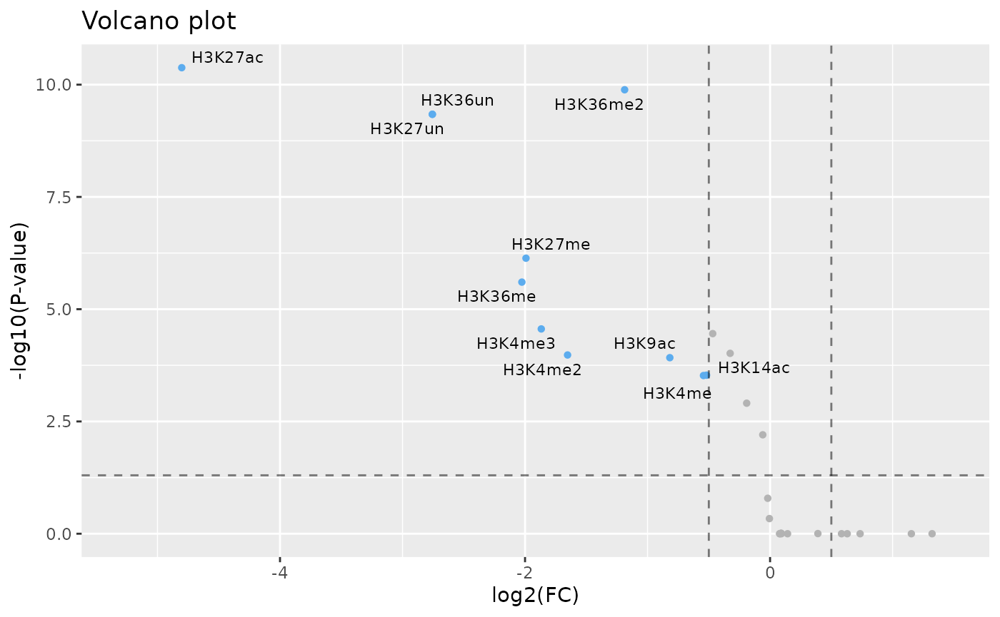

``` r

# Clearing large variables
rm(MCF7_histones, histone_frag_raw, histone_single_raw)
```

## 4. Disease enrichment

Here we perform disease enrichment using the [MSigDB
database](https://www.gsea-msigdb.org/gsea/msigdb/human/genesets.jsp)
and the MSigDBR package. First, identify a dataset of interest in the
database. The next chunk shows databases sourced through MSigDB but
originating from PubMed and Human Phenotype Ontology. The `collection`
parameter identifies the MSigDB collection to search, followed by
`gs_exact_source` that specifies the selected dataset. This can also be
replaced with `gs_id` if you are using the “Systematic name” value on
the website.

We enrich our primary disease of interest (breast cancer), but also
include enrichment for hypertension and ovarian cancer.

``` r

GDA_ERBC <- msigdbr(collection = "C2") %>% filter(gs_id == "M18299")
GDA_HT <- msigdbr(collection = "C5") %>% filter(gs_exact_source == "HP:0000822")
GDA_OvCa <- msigdbr(collection = "C5") %>% filter(gs_exact_source == "HP:0100615")
```

This chunk creates Venn diagrams of the overlap between proteins that
were significant and above the fold change threshold in the total and
phosphoproteome, as well as the genes of interest that were just
retrieved.

``` r

# Get lists of proteins that were significant AND above the FC threshold
total_FC <- filter(MCF7_total_sig, abs(`log2(FC)`) > total_FC_threshold)
phospho_FC <- filter(MCF7_phospho_sig, abs(`log2(FC)`) > phospho_FC_threshold)

# Generate plot
ggvenn(list(
  "ER breast cancer" = GDA_ERBC$gene_symbol,
  "Total proteome" = total_FC$Symbol,
  "Phosphoproteome" = phospho_FC$Symbol),
  fill_color = c("#440154", "#21908C", "#FDE725"),
  show_percentage = FALSE, text_size = 5) + ggtitle("MCF-7 enrichment") + theme(
  plot.title.position = "plot",
  plot.title = element_text(hjust = 0.5))
```

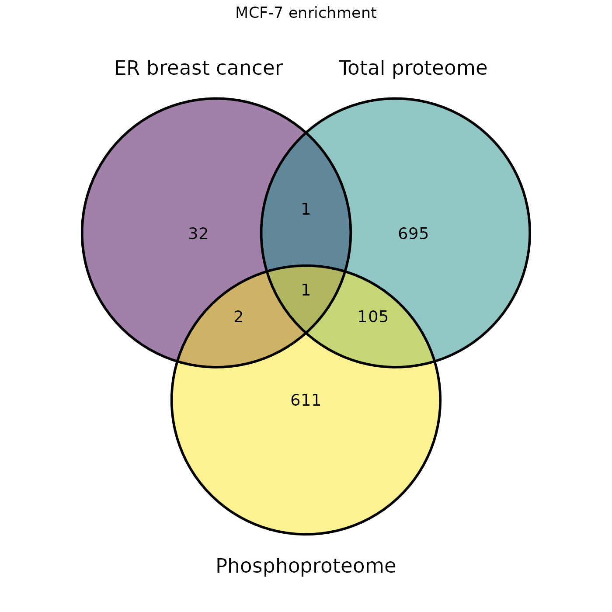

``` r


ggvenn(list(
  "Hypertension" = GDA_HT$gene_symbol,
  "Total proteome" = total_FC$Symbol,
  "Phosphoproteome" = phospho_FC$Symbol),
  fill_color = c("#440154", "#21908C", "#FDE725"),
  show_percentage = FALSE, text_size = 5) + ggtitle("MCF-7 enrichment") + theme(
  plot.title.position = "plot",
  plot.title = element_text(hjust = 0.5))
```

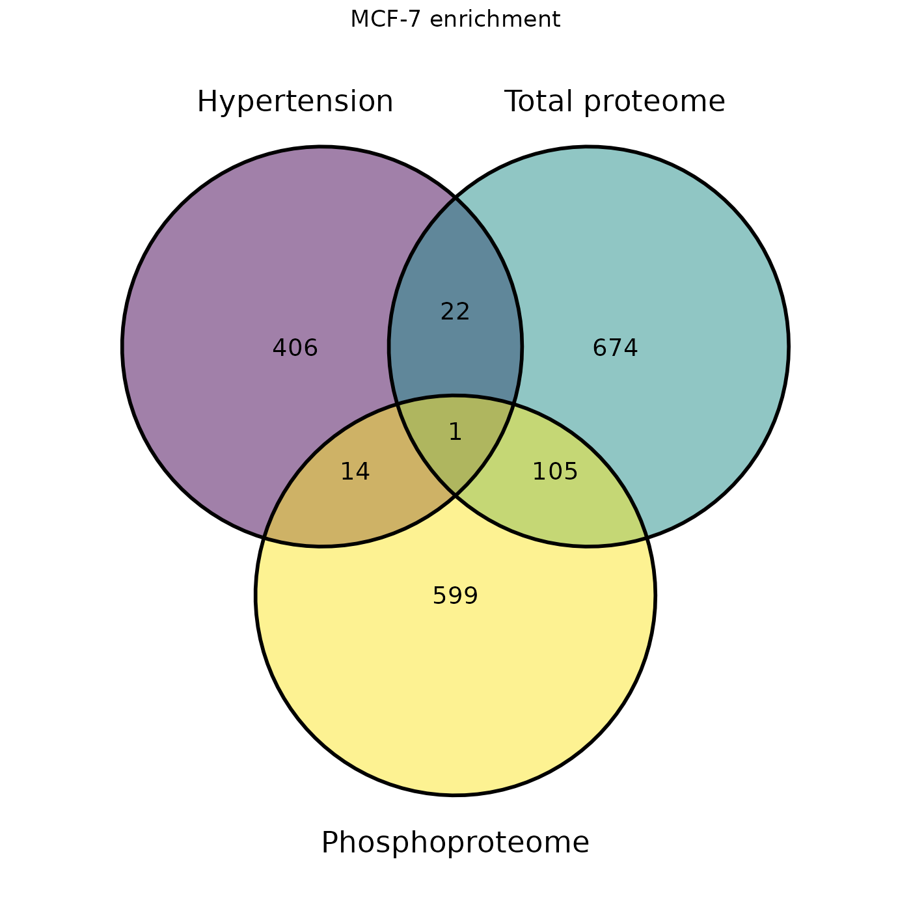

``` r


ggvenn(list(
  "Ovarian cancer" = GDA_OvCa$gene_symbol,
  "Total proteome" = total_FC$Symbol,
  "Phosphoproteome" = phospho_FC$Symbol),
  fill_color = c("#440154", "#21908C", "#FDE725"),
  show_percentage = FALSE, text_size = 5) + ggtitle("MCF-7 enrichment") + theme(
  plot.title.position = "plot",
  plot.title = element_text(hjust = 0.5))
```

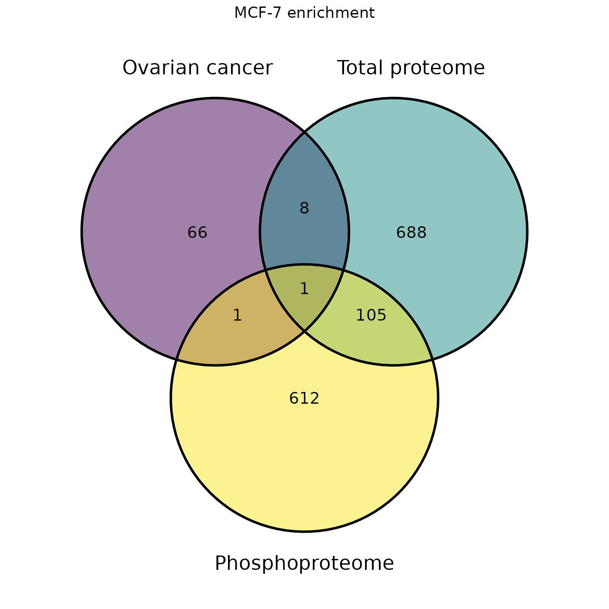

We next print a list of proteins in the four intersecting areas for
further investigation in our disease of interest.

``` r

# Print the list of proteins in each intersection
ERBC_intersections <- data.frame("Intersection" = character(),
                                 "Hits" = character(),
                                 stringsAsFactors = FALSE)
ERBC_intersections <- ERBC_intersections %>%
  add_row("Intersection" = "ER breast cancer/Phospho",
          "Hits" = paste(sort(intersect(GDA_ERBC$gene_symbol, phospho_FC$Symbol)),
                         collapse = ", ")) %>% 
  add_row("Intersection" = "ER breast cancer/Total",
          "Hits" = paste(sort(intersect(GDA_ERBC$gene_symbol, total_FC$Symbol)),
                         collapse = ", ")) %>% 
  add_row("Intersection" = "Total/Phospho",
          "Hits" = paste(sort(intersect(total_FC$Symbol, phospho_FC$Symbol)),
                         collapse = ", ")) %>% 
  add_row("Intersection" = "ER breast cancer/Phospho/Total",
          "Hits" = paste(sort(intersect(intersect(
            GDA_ERBC$gene_symbol, phospho_FC$Symbol),
            total_FC$Symbol)), collapse = ", "))

knitr::kable(ERBC_intersections, caption = "ERBC intersections")
```

| Intersection | Hits |
|:---|:---|
| ER breast cancer/Phospho | AHNAK, KDM4B, MAGED2 |
| ER breast cancer/Total | ANXA9, KDM4B |
| Total/Phospho | AHNAK2, AJUBA, AKAP13, ALDOC, ANKRD17, ARHGAP29, ARHGEF18, ASH2L, ASPSCR1, ATP2B1, BAG3, BCKDHA, BIN1, BRSK2, BTRC, BUB1, CAMKK1, CCZ1, CD83, CDC20, CDC25C, CDK18, CHML, CLASP2, CTNNB1, CTTNBP2, DAB2, DAG1, DDB2, DDX24, DIAPH3, EHBP1L1, EIF4EBP2, EIF4G2, ELAVL1, FARP2, FERMT2, FNTB, IRS2, IVNS1ABP, JAG2, JUNB, KCTD5, KDM3A, KDM4A, KDM4B, KIF20A, KLHDC10, LARP4, LPIN3, LRRC41, MLXIP, NCAPD2, NEMF, NFKB2, NOP2, NUFIP1, NUFIP2, NYAP2, OSER1, PARP1, PHLDB1, PKP3, PPA2, PPP1R15B, PPP2R3A, PRR11, PRRC2B, PTGFRN, RABGGTB, RAD54B, RBM14, RBM4, RBM47, RNF25, RPL27A, RPL31, RPS10, RPUSD2, SAMHD1, SHMT2, SKA3, SKP2, SLC1A5, SLC6A15, STBD1, TACC1, TBL1XR1, TCF3, TJP3, TNRC6B, TP53RK, TRAF7, TTF2, TTK, UBAP2, UHRF1, USP6NL, VEZF1, VRK3, XRN2, YBX1, YBX3, YTHDF2, ZFAND5, ZNF800 |
| ER breast cancer/Phospho/Total | KDM4B |

ERBC intersections {.table}

``` r

HT_intersections <- data.frame("Intersection" = character(),
                                 "Hits" = character(),
                                 stringsAsFactors = FALSE)
HT_intersections <- HT_intersections %>%
  add_row("Intersection" = "Hypertension/Phospho",
          "Hits" = paste(sort(intersect(GDA_HT$gene_symbol, phospho_FC$Symbol)),
                         collapse = ", ")) %>% 
  add_row("Intersection" = "Hypertension/Total",
          "Hits" = paste(sort(intersect(GDA_HT$gene_symbol, total_FC$Symbol)),
                         collapse = ", ")) %>% 
  add_row("Intersection" = "Total/Phospho",
          "Hits" = paste(sort(intersect(total_FC$Symbol, phospho_FC$Symbol)),
                         collapse = ", ")) %>% 
  add_row("Intersection" = "Hypertension/Phospho/Total",
          "Hits" = paste(sort(intersect(intersect(
            GDA_HT$gene_symbol, phospho_FC$Symbol),
            total_FC$Symbol)), collapse = ", "))

knitr::kable(HT_intersections, caption = "Hypertension intersections")
```

| Intersection | Hits |
|:---|:---|
| Hypertension/Phospho | CTNNB1, CTR9, ERCC6, INF2, JMJD1C, KDM1A, LDLRAP1, LIMK1, MEF2A, MTRR, MUC1, NOTCH2, REST, SLC20A2, SMARCAL1 |
| Hypertension/Total | ALMS1, ARVCF, BAZ1B, BICC1, CCND1, CDKN1B, CEP83, CTNNB1, ENG, EXT2, FDXR, H4C3, H6PD, IMPDH2, KIAA0319L, LOX, MAX, MECP2, PRNP, SDHA, TGFBR2, TRIM32, VANGL1 |
| Total/Phospho | AHNAK2, AJUBA, AKAP13, ALDOC, ANKRD17, ARHGAP29, ARHGEF18, ASH2L, ASPSCR1, ATP2B1, BAG3, BCKDHA, BIN1, BRSK2, BTRC, BUB1, CAMKK1, CCZ1, CD83, CDC20, CDC25C, CDK18, CHML, CLASP2, CTNNB1, CTTNBP2, DAB2, DAG1, DDB2, DDX24, DIAPH3, EHBP1L1, EIF4EBP2, EIF4G2, ELAVL1, FARP2, FERMT2, FNTB, IRS2, IVNS1ABP, JAG2, JUNB, KCTD5, KDM3A, KDM4A, KDM4B, KIF20A, KLHDC10, LARP4, LPIN3, LRRC41, MLXIP, NCAPD2, NEMF, NFKB2, NOP2, NUFIP1, NUFIP2, NYAP2, OSER1, PARP1, PHLDB1, PKP3, PPA2, PPP1R15B, PPP2R3A, PRR11, PRRC2B, PTGFRN, RABGGTB, RAD54B, RBM14, RBM4, RBM47, RNF25, RPL27A, RPL31, RPS10, RPUSD2, SAMHD1, SHMT2, SKA3, SKP2, SLC1A5, SLC6A15, STBD1, TACC1, TBL1XR1, TCF3, TJP3, TNRC6B, TP53RK, TRAF7, TTF2, TTK, UBAP2, UHRF1, USP6NL, VEZF1, VRK3, XRN2, YBX1, YBX3, YTHDF2, ZFAND5, ZNF800 |
| Hypertension/Phospho/Total | CTNNB1 |

Hypertension intersections {.table}

``` r

OvCa_intersections <- data.frame("Intersection" = character(),
                                 "Hits" = character(),
                                 stringsAsFactors = FALSE)
OvCa_intersections <- OvCa_intersections %>%
  add_row("Intersection" = "Ovarian cancer/Phospho",
          "Hits" = paste(sort(intersect(GDA_OvCa$gene_symbol, phospho_FC$Symbol)),
                         collapse = ", ")) %>% 
  add_row("Intersection" = "Ovarian cancer/Total",
          "Hits" = paste(sort(intersect(GDA_OvCa$gene_symbol, total_FC$Symbol)),
                         collapse = ", ")) %>% 
  add_row("Intersection" = "Total/Phospho",
          "Hits" = paste(sort(intersect(total_FC$Symbol, phospho_FC$Symbol)),
                         collapse = ", ")) %>% 
  add_row("Intersection" = "Ovarian cancer/Phospho/Total",
          "Hits" = paste(sort(intersect(intersect(
            GDA_OvCa$gene_symbol, phospho_FC$Symbol),
            total_FC$Symbol)), collapse = ", "))

knitr::kable(OvCa_intersections, caption = "Ovarian cancer intersections")
```

| Intersection | Hits |
|:---|:---|
| Ovarian cancer/Phospho | CTNNB1, MBD4 |
| Ovarian cancer/Total | CTNNB1, DICER1, IDH2, KEAP1, MAP3K1, PALLD, PTEN, RABL3, TGFBR2 |
| Total/Phospho | AHNAK2, AJUBA, AKAP13, ALDOC, ANKRD17, ARHGAP29, ARHGEF18, ASH2L, ASPSCR1, ATP2B1, BAG3, BCKDHA, BIN1, BRSK2, BTRC, BUB1, CAMKK1, CCZ1, CD83, CDC20, CDC25C, CDK18, CHML, CLASP2, CTNNB1, CTTNBP2, DAB2, DAG1, DDB2, DDX24, DIAPH3, EHBP1L1, EIF4EBP2, EIF4G2, ELAVL1, FARP2, FERMT2, FNTB, IRS2, IVNS1ABP, JAG2, JUNB, KCTD5, KDM3A, KDM4A, KDM4B, KIF20A, KLHDC10, LARP4, LPIN3, LRRC41, MLXIP, NCAPD2, NEMF, NFKB2, NOP2, NUFIP1, NUFIP2, NYAP2, OSER1, PARP1, PHLDB1, PKP3, PPA2, PPP1R15B, PPP2R3A, PRR11, PRRC2B, PTGFRN, RABGGTB, RAD54B, RBM14, RBM4, RBM47, RNF25, RPL27A, RPL31, RPS10, RPUSD2, SAMHD1, SHMT2, SKA3, SKP2, SLC1A5, SLC6A15, STBD1, TACC1, TBL1XR1, TCF3, TJP3, TNRC6B, TP53RK, TRAF7, TTF2, TTK, UBAP2, UHRF1, USP6NL, VEZF1, VRK3, XRN2, YBX1, YBX3, YTHDF2, ZFAND5, ZNF800 |
| Ovarian cancer/Phospho/Total | CTNNB1 |

Ovarian cancer intersections {.table}

``` r

# Clearing large variables
rm(GDA_ERBC, GDA_HT, GDA_OvCa, ERBC_intersections, HT_intersections, OvCa_intersections)
```

## 5. Epigenetic network

This section develops a network visualization of all epigenetic
interactions as defined by EpiFactors
(<https://epifactors.autosome.org/>). Increased dataset size may make
networks difficult to visualize, so an interactive network is drawn in
Python and rendered as an embedded HTML file.

The `data(genes)` call imports a .csv file included with the MPOInt
package, but can be replaced to update or change the database by
downloading and importing the “Table of all proteins” file on the
EpiFactors website.

It is important to note that here we choose to use all histones
identified and limit the proteome/phosphoproteome by unadjusted P value
rather than the FDR-corrected Q value. Given that this tool is intended
for discovery and requires downstream validation of its findings, as
well as the lack of in-depth resources detailing epigenetic
interactions, we chose to include as many potential hits as possible,
then evaluate the findings based on the context of the overall developed
network in addition to the epiproteome fragment analysis. Below, we also
generate a smaller network abiding by more rigorous statistical
standards as a demonstration.

### 5.1 Complex and member identification

For future research use, we generate multiple tables containing the
identified complexes, members, common targets, and identified PTMs.

``` r

# Adding framework for connections
data(genes)
# Creating the network object with the significant peptide subsets
net_created <- 
  multi_net(genes_df = genes, total_df = MCF7_total_sig_unadj,
            phospho_df = MCF7_phospho_sig_unadj,
            # Point to the gene symbols and transformed FC values
            symbol_col = "Symbol", fc_col = "log2(FC)",
            # The network will not assemble with the fragment data
            epi_single_df = histone_single,
            epi_symbol_col = "PTM", epi_fc_col = "log2(FC)")
#> Joining with `by = join_by(`HGNC approved symbol`, `UniProt ID (human)`,
#> Function, Modification, `Protein complex`, `Target entity`, Product,
#> `log2(FC)`, Source)`

# Accessing the plots and lists created as part of the object
net_created$grid
```

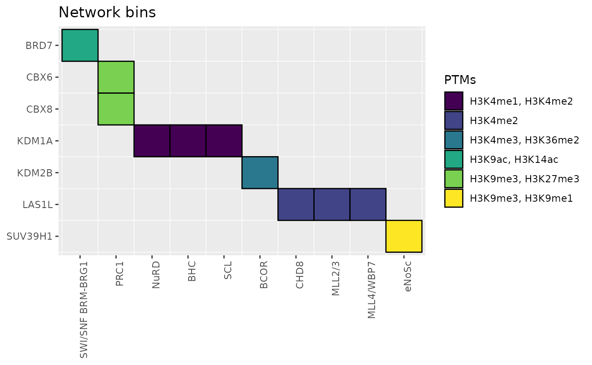

``` r

net_created$complex_list
#>  [1] "B-WICH"               "BAF"                  "bBAF"                
#>  [4] "BCOR"                 "BHC"                  "CAF-1"               
#>  [7] "CHD8"                 "COMPASS-like MLL1,2"  "COMPASS-like MLL3,4" 
#> [10] "core HDAC"            "CREST-BRG1"           "eNoSc"               
#> [13] "HBO1"                 "LSD-CoREST"           "MLL-HCF"             
#> [16] "MLL2/3"               "MLL4/WBP7"            "MOZ/MORF"            
#> [19] "mSin3A"               "mSin3A-like complex"  "nBAF"                
#> [22] "npBAF"                "NSL"                  "NuA4"                
#> [25] "NuA4-related complex" "NuRD"                 "NuRF"                
#> [28] "PBAF"                 "Piccolo_NuA4"         "PRC1"                
#> [31] "PRC2"                 "RING2-FBRS"           "RING2-L3MBTL2"       
#> [34] "SAGA"                 "SCL"                  "SRCAP"               
#> [37] "STAGA"                "SWI/SNF BRM-BRG1"     "SWI/SNF_Brg1(I)"     
#> [40] "SWI/SNF_Brg1(II)"     "SWI/SNF_Brm"          "SWI/SNF-like EPAFB"  
#> [43] "SWI/SNF-like_EPAFa"   "SWR"                  "WINAC"
knitr::kable(net_created$member_list)
```

| Complex | Members | PTMs |
|:---|:---|:---|
|  |  |  |
| B-WICH | BAZ1B, DEK | H2AXT142, H2AXY142ph, H3, H4 |
| BAF | SMARCA2, SMARCA4 | H3, H4 |
| bBAF | SMARCA2, SMARCA4 | H3, H4 |
| BCOR | KDM2B, RNF2 | H3K4me3, H3K4, H3K36, H3K36me2, H2AK119, H2AK119ub |
| BHC | KDM1A | H3K4me1, H3K4, H3K9, H3K4me2, H3K9me |
| CAF-1 | CHAF1A, CHAF1B, RBBP4 | H3, H4 |
| CHD8 | CHD8, HCFC2, KANSL1, KDM6A, KMT2A, LAS1L, PHF20, RNF2, TAF1 | H1, H3, H4, H4ac, H3K27me2. H3K27me3, H3K27, H3K4, H3K4me, H3K4me2, H3Ac, H4Ac, H2AAc, H3,H4,H2A, H2AK119, H2AK119ub, H3ac |
| COMPASS-like MLL1,2 | KMT2A | H3K4, H3K4me |
| COMPASS-like MLL3,4 | KDM6A | H3K27me2. H3K27me3, H3K27 |
| core HDAC | RBBP4, RBBP7 | H4 |
| CREST-BRG1 | SMARCA4 | H3, H4 |
| eNoSc | SUV39H1 | H3S10, H3K9me3, H3K9me1, H4 |
| HBO1 | KAT7 | H4, H4ac |
| LSD-CoREST | HMG20A | H3K4 |
| MLL-HCF | HCFC2, KMT2A | H3, H3K4, H3K4me |
| MLL2/3 | CHD8, HCFC2, KANSL1, KDM6A, LAS1L, PHF20, RNF2, TAF1 | H1, H3, H4, H4ac, H3K27me2. H3K27me3, H3K27, H3K4, H3K4me, H3K4me2, H3Ac, H4Ac, H2AAc, H3,H4,H2A, H2AK119, H2AK119ub, H3ac |
| MLL4/WBP7 | CHD8, HCFC2, KANSL1, KDM6A, LAS1L, PHF20, RNF2, TAF1 | H1, H3, H4, H4ac, H3K27me2. H3K27me3, H3K27, H3K4, H3K4me, H3K4me2, H3Ac, H4Ac, H2AAc, H3,H4,H2A, H2AK119, H2AK119ub, H3ac |
| MOZ/MORF | KAT6B | H3, H3ac |
| mSin3A | RBBP4, RBBP7 | H4 |
| mSin3A-like complex | RBBP4, RBBP7 | H4 |
| nBAF | SMARCA2, SMARCA4 | H3, H4 |
| npBAF | SMARCA2, SMARCA4 | H3, H4 |
| NSL | KANSL1, OGT, PHF20 | H4, H4ac, H2BS112, H2BS112GlcNa |
| NuA4 | ING3 | H2A, H4 |
| NuA4-related complex | SRCAP | H2A.Z |
| NuRD | GATAD2A, GATAD2B, KDM1A, RBBP4, RBBP7 | H2A, H2B, H3, H4, H3K4me1, H3K4, H3K9, H3K4me2, H3K9me |
| NuRF | RBBP4, RBBP7 | H4 |
| PBAF | SMARCA4 | H3, H4 |
| Piccolo_NuA4 | ING3 | H2A, H4 |
| PRC1 | CBX6, CBX8, RNF2 | H3K9me3, H3K27me3, H2AK119, H2AK119ub |
| PRC2 | RBBP4, RBBP7 | H4 |
| RING2-FBRS | RNF2 | H2AK119, H2AK119ub |
| RING2-L3MBTL2 | L3MBTL2, RNF2 | H3K4, H3K9, H3K27, H4K20, H2AK119, H2AK119ub |
| SAGA | USP22 | H2Aub, H2A, H2B, H2Bub |
| SCL | KDM1A, SFMBT1 | H3K4me1, H3K4, H3K9, H3K4me2, H3K9me, H4K20 |
| SRCAP | SRCAP | H2A.Z |
| STAGA | TADA1 | H2A |
| SWI/SNF BRM-BRG1 | BRD7, BRD9, SMARCA2, SMARCA4 | H3K9ac, H3K14ac, H3K8ac, H3, H4 |
| SWI/SNF_Brg1(I) | RBBP4, SMARCA4 | H4, H3 |
| SWI/SNF_Brg1(II) | RBBP4, SMARCA4 | H4, H3 |
| SWI/SNF_Brm | RBBP4, SMARCA4 | H4, H3 |
| SWI/SNF-like EPAFB | SMARCA4 | H3, H4 |
| SWI/SNF-like_EPAFa | SMARCA4 | H3, H4 |
| SWR | ING3 | H2A, H4 |
| WINAC | BAZ1B, CHAF1B, SMARCA2, SMARCA4 | H2AXT142, H2AXY142ph, H3, H4 |

``` r

knitr::kable(net_created$gene_list)
```

| HGNC approved symbol | Function | Modification | Protein complex | Target entity | Product |
|:---|:---|:---|:---|:---|:---|
| BAZ1B | Histone modification write | Histone phosphorylation | B-WICH, WINAC | H2AXT142, H3 | H2AXY142ph |
| BRD7 | Histone modification read | \# | SWI/SNF BRM-BRG1 | H3K9ac, H3K14ac, H3K8ac | \# |
| BRD9 | Histone modification read | \# | SWI/SNF BRM-BRG1 | H3 | \# |
| CBX6 | Histone modification read | \# | PRC1 | H3K9me3, H3K27me3 | \# |
| CBX8 | Histone modification read | \# | PRC1 | H3K9me3, H3K27me3 | \# |
| CHAF1A | Chromatin remodeling | \# | CAF-1 | H3, H4 | \# |
| CHAF1B | Chromatin remodeling | \# | WINAC, CAF-1 | H3, H4 | \# |
| CHD8 | Chromatin remodeling | \# | CHD8, MLL2/3, MLL4/WBP7 | H1 | \# |
| DEK | Chromatin remodeling | \# | B-WICH | H4 | \# |
| GATAD2A | Histone modification read | \# | NuRD | H2A, H2B, H3, H4 | \# |
| GATAD2B | Histone modification read | \# | NuRD | H2A, H2B, H3, H4 | \# |
| HCFC2 | Histone modification write cofactor, Histone modification write cofactor | Histone methylation, Histone acetylation | MLL-HCF, CHD8, MLL2/3, MLL4/WBP7 | H3 | \# |
| HMG20A | Chromatin remodeling cofactor | \# | LSD-CoREST | H3K4 | \# |
| ING3 | Chromatin remodeling, Histone modification write cofactor | Histone acetylation | SWR, NuA4, Piccolo_NuA4 | H2A, H4 | \# |
| KANSL1 | Histone modification write cofactor, Histone modification write cofactor | Histone methylation, Histone acetylation | NSL, CHD8, MLL2/3, MLL4/WBP7 | H4 | H4ac |
| KAT6B | Histone modification write | Histone acetylation | MOZ/MORF | H3 | H3ac |
| KAT7 | Histone modification write | Histone acetylation | HBO1 | H4 | H4ac |
| KDM1A | Histone modification erase | Histone methylation | NuRD, BHC, SCL | H3K4me1, H3K4me2, H3K9me | H3K4, H3K9 |
| KDM2B | Histone modification erase | Histone methylation | BCOR | H3K4me3, H3K36me2 | H3K4, H3K36 |
| KDM6A | Histone modification erase | Histone methylation | CHD8, MLL2/3, MLL4/WBP7, COMPASS-like MLL3,4 | H3K27me2. H3K27me3 | H3K27 |
| KMT2A | Histone modification write | Histone methylation | MLL-HCF, CHD8, COMPASS-like MLL1,2 | H3K4 | H3K4me |
| L3MBTL2 | Histone modification read | \# | RING2-L3MBTL2 | H3K4, H3K9, H3K27, H4K20 | \# |
| LAS1L | Histone modification write cofactor, Histone modification write cofactor | Histone methylation, Histone acetylation | CHD8, MLL2/3, MLL4/WBP7 | H3K4, H3,H4,H2A | H3K4me, H3K4me2, H3Ac, H4Ac, H2AAc |
| OGT | Histone modification write | Histone GlcNAcylation | NSL | H2BS112 | H2BS112GlcNa |
| PHF20 | Histone modification write | Histone acetylation | NSL, CHD8, MLL2/3, MLL4/WBP7 | H4 | H4ac |
| RBBP4 | Histone chaperone | \# | NuRF, SWI/SNF_Brg1(I), SWI/SNF_Brg1(II), SWI/SNF_Brm, NuRD, mSin3A, core HDAC, mSin3A-like complex, PRC2, CAF-1 | H4 | \# |
| RBBP7 | Histone chaperone | \# | NuRF, NuRD, mSin3A, core HDAC, mSin3A-like complex, PRC2 | H4 | \# |
| RNF2 | Histone modification write | Histone ubiquitination | PRC1, BCOR, RING2-L3MBTL2, RING2-FBRS, CHD8, MLL2/3, MLL4/WBP7 | H2AK119 | H2AK119ub |
| SFMBT1 | Polycomb group (PcG) protein | \# | SCL | H4K20 | \# |
| SMARCA2 | Histone modification read, TF | TF activator | BAF, nBAF, npBAF, WINAC, bBAF, SWI/SNF BRM-BRG1 | H3, DNA motif | \# |
| SMARCA4 | Histone modification read, TF | TF activator | BAF, nBAF, npBAF, PBAF, SWI/SNF_Brg1(I), SWI/SNF_Brg1(II), SWI/SNF_Brm, SWI/SNF-like_EPAFa, WINAC, SWI/SNF-like EPAFB, bBAF, SWI/SNF BRM-BRG1, CREST-BRG1 | H3, H4 | \# |
| SRCAP | Chromatin remodeling, Histone modification erase | Histone acetylation | NuA4-related complex, SRCAP | H2A.Z | \# |
| SUV39H1 | Histone modification write, Histone modification write | Histone methylation, Histone phosphorylation | eNoSc | H3S10, H3K9me1, H4 | H3K9me3 |
| TADA1 | Histone chaperone | \# | STAGA | H2A | \# |
| TAF1 | Histone modification write | Histone acetylation | CHD8, MLL2/3, MLL4/WBP7 | H3, H4 | H3ac, H4ac |
| USP22 | Histone modification write cofactor | Histone ubiquitination | SAGA | H2Aub, H2Bub | H2A, H2B |

``` r

# Getting a dataframe with the significant network members
sn_df <- net_created$ts

# Creating two tables (centered on protein, then centered on histone PTMs) with
# more descriptive information
sn_collapsed_gene <- sn_df %>%
  group_by(Symbol, `log2(FC)_gene`, `P value`) %>%
  summarize(Source = paste(unique(Source), collapse = ", "), PTMs = paste(unique(PTM), collapse = ", "), Complexes = paste(unique(Complex), collapse = ", ")) %>% 
  rename("log2(FC)_gene" = "log2(FC) (gene)")
#> `summarise()` has regrouped the output.
#> ℹ Summaries were computed grouped by Symbol, log2(FC)_gene, and P value.
#> ℹ Output is grouped by Symbol and log2(FC)_gene.
#> ℹ Use `summarise(.groups = "drop_last")` to silence this message.
#> ℹ Use `summarise(.by = c(Symbol, log2(FC)_gene, P value))` for per-operation
#>   grouping (`?dplyr::dplyr_by`) instead.
knitr::kable(sn_collapsed_gene)
```

| Symbol  | log2(FC) (gene) |   P value | Source  | PTMs     | Complexes               |
|:--------|----------------:|----------:|:--------|:---------|:------------------------|
| BRD7    |       3.3516551 | 0.0051165 | Phospho | H3K9ac   | SWI/SNF BRM-BRG1        |
| BRD7    |       3.3516551 | 0.0115405 | Phospho | H3K14ac  | SWI/SNF BRM-BRG1        |
| CBX6    |      -1.3745574 | 0.0006312 | Total   | H3K9me3  | PRC1                    |
| CBX6    |      -1.3745574 | 0.0057442 | Total   | H3K27me3 | PRC1                    |
| CBX8    |      -1.5770182 | 0.0006312 | Phospho | H3K9me3  | PRC1                    |
| CBX8    |      -1.5770182 | 0.0057442 | Phospho | H3K27me3 | PRC1                    |
| KDM1A   |       0.7623012 | 0.0045019 | Phospho | H3K4me2  | NuRD, BHC, SCL          |
| KDM1A   |       0.7623012 | 0.0117262 | Phospho | H3K4me1  | NuRD, BHC, SCL          |
| KDM2B   |       1.5716614 | 0.0000000 | Total   | H3K36me2 | BCOR                    |
| KDM2B   |       1.5716614 | 0.0012717 | Total   | H3K4me3  | BCOR                    |
| KDM2B   |       1.7761875 | 0.0000000 | Phospho | H3K36me2 | BCOR                    |
| KDM2B   |       1.7761875 | 0.0012717 | Phospho | H3K4me3  | BCOR                    |
| LAS1L   |      -0.3720788 | 0.0045019 | Total   | H3K4me2  | CHD8, MLL2/3, MLL4/WBP7 |
| SUV39H1 |      -2.4745292 | 0.0006312 | Total   | H3K9me3  | eNoSc                   |
| SUV39H1 |      -2.4745292 | 0.0041631 | Total   | H3K9me1  | eNoSc                   |

``` r


sn_collapsed_PTM <- sn_df %>%
  group_by(PTM, `log2(FC)_hist`) %>%
  summarize(Genes = paste(unique(Symbol), collapse = ", "), Complexes = paste(unique(Complex), collapse = ", ")) %>% 
  rename("log2(FC)_hist" = "log2(FC) (PTM)")
#> `summarise()` has regrouped the output.
#> ℹ Summaries were computed grouped by PTM and log2(FC)_hist.
#> ℹ Output is grouped by PTM.
#> ℹ Use `summarise(.groups = "drop_last")` to silence this message.
#> ℹ Use `summarise(.by = c(PTM, log2(FC)_hist))` for per-operation grouping
#>   (`?dplyr::dplyr_by`) instead.
knitr::kable(sn_collapsed_PTM)
```

| PTM | log2(FC) (PTM) | Genes | Complexes |
|:---|---:|:---|:---|
| H3K14ac | -0.5186679 | BRD7 | SWI/SNF BRM-BRG1 |
| H3K27me3 | 0.7348173 | CBX6, CBX8 | PRC1 |
| H3K36me2 | -1.1871007 | KDM2B | BCOR |
| H3K4me1 | -0.5436012 | KDM1A | NuRD, BHC, SCL |
| H3K4me2 | -1.6529224 | KDM1A, LAS1L | NuRD, BHC, SCL, CHD8, MLL2/3, MLL4/WBP7 |
| H3K4me3 | -1.8674603 | KDM2B | BCOR |
| H3K9ac | -0.8182797 | BRD7 | SWI/SNF BRM-BRG1 |
| H3K9me1 | -0.3258271 | SUV39H1 | eNoSc |
| H3K9me3 | 0.5830808 | CBX6, CBX8, SUV39H1 | PRC1, eNoSc |

``` r

# Creating a Sankey flow diagram for an alternate representation
# of how complexes, PTMs, and members are connected
sankey_sn <- sn_df
sankey_sn$Complex <- str_wrap(sankey_sn$Complex, 10)
node_names <- unique(c(sankey_sn$PTM, unique(sankey_sn$Complex)))

v_pal_res <- (viridis_pal(begin = 0.1, option = "D")(length(node_names)))
names(v_pal_res) <- node_names

link_pal <- rep("gray60", times = length(unique(sankey_sn$Symbol)))
names(link_pal) <- unique(sankey_sn$Symbol)

SankeyPlot(arrange(sankey_sn, PTM), x = c("PTM", "Complex"), in_form = "wide",
           links_fill_by = "Symbol", nodes_label = TRUE, xlab = "", ylab = "",
           expand = c(0.1, 0.6), facet_by = "Symbol", facet_scales = "free_y",
           aspect.ratio = 1, facet_ncol = 4, theme_args = list(strip.background = ggplot2::element_rect(fill="grey80")), nodes_legend = "separate",
           links_palcolor = link_pal, links_color = ".fill",
           nodes_palcolor = v_pal_res) +
  theme(legend.position = "none", axis.text.y = element_blank(), axis.ticks.y = element_blank())
```

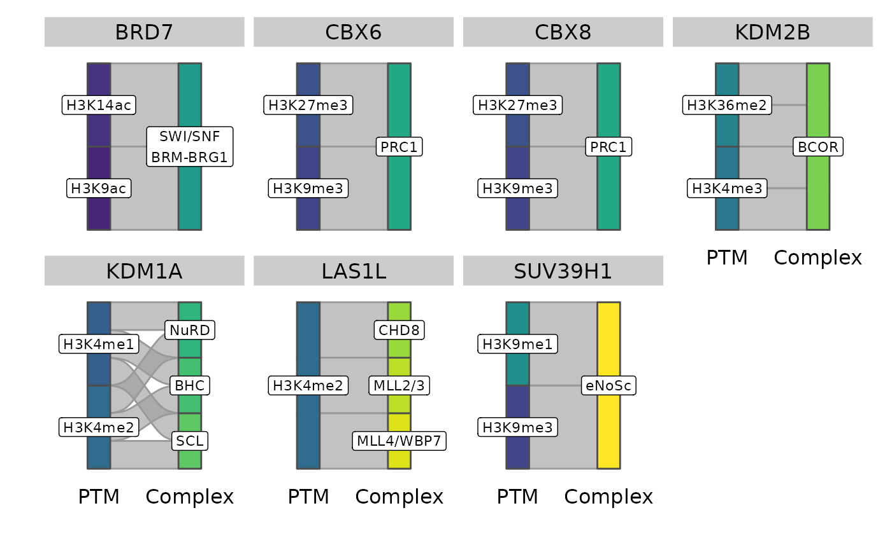

### 5.2 Python visualization

Finally, we create an interactive network using Python via the
`reticulate` package. This allows a dynamic visualization that can be
refined and filtered to generate different views.

``` r

net_edges_py <- r_to_py(net_created$net_edges)
net_vertices_py <- r_to_py(net_created$net_vertices)
```

``` python
import pandas as pd, networkx as nx
from pyvis.network import Network
# Create NetworkX graph object
G = nx.Graph()

# Generate a nested dictionary/tuple with the node of interest ("Symbol") and 
# the relevant attributes (shape and complex)
node_list = []
for i, row in r.net_vertices_py.iterrows():
  node_list.append((row["Symbol"], {"color": {"background": row.Colors, "border": row.Border}, "Complex": row.Complex, "shape": row.Shapes}))
G.add_nodes_from(node_list)

# Generate a tuple for edges connecting proteins with PTMs
edge_tup = []
for i in range(len(r.net_edges_py["Symbol"])):
  edge_tup.append((r.net_edges_py["Symbol"][i], r.net_edges_py["PTM"][i]))
G.add_edges_from(edge_tup)

# Remove self-loops
G.remove_edges_from(nx.selfloop_edges(G))

# Now remove nodes without edges
lone_nodes = [node for node, degree in G.degree() if degree == 0]
G.remove_nodes_from(lone_nodes)
# To change the parameters of what's being graphed, adjust the initial call to Network()
net = Network(height="900px", notebook = True, select_menu = True, cdn_resources = "in_line")
net.from_nx(G)
net.save_graph("networkx-pyvis-MCF.html")
```

``` r

htmltools::renderDocument(htmltools::htmlTemplate("networkx-pyvis-MCF.html"))
```

## 

## 

Select a Node by ID H3K4me1 KDM1A H3K4me2 LAS1L H3K4me3 KDM2B H3K9me1
SUV39H1 H3K9me3 CBX6 CBX8 H3K9ac BRD7 H3K14ac H3K27me3 H3K36me2

Reset Selection

### 5.3 Minimal network

``` r

# This value (and selected metric) can be adjusted to fit the data
histone_single_p <- filter(histone_single, `P_unadj` < 0.2)

# Now making a network with a subset of histones, as well as
# proteome/phosphoproteome peptides that meet the FDR-adjusted threshold
net_created_hp <- multi_net(genes_df = genes, total_df = MCF7_total_sig,
          phospho_df = MCF7_phospho_sig, symbol_col = "Symbol", fc_col = "log2(FC)",
          epi_single_df = histone_single_p,
          epi_symbol_col = "PTM", epi_fc_col = "log2(FC)")
#> Joining with `by = join_by(`HGNC approved symbol`, `UniProt ID (human)`,
#> Function, Modification, `Protein complex`, `Target entity`, Product,
#> `log2(FC)`, Source)`
net_created_hp$grid
```

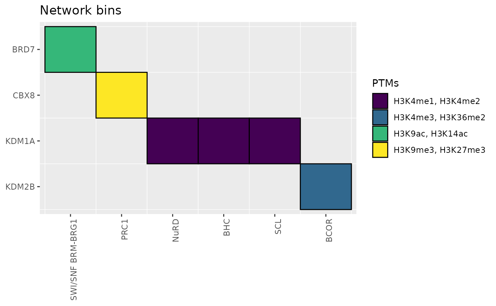

``` r

net_created_hp$complex_list
#>  [1] "B-WICH"              "BAF"                 "bBAF"               
#>  [4] "BCOR"                "BHC"                 "CAF-1"              
#>  [7] "CHD8"                "COMPASS-like MLL1,2" "core HDAC"          
#> [10] "CREST-BRG1"          "HBO1"                "LSD-CoREST"         
#> [13] "MLL-HCF"             "MLL2/3"              "MLL4/WBP7"          
#> [16] "mSin3A"              "mSin3A-like complex" "nBAF"               
#> [19] "npBAF"               "NuRD"                "NuRF"               
#> [22] "PBAF"                "PRC1"                "PRC2"               
#> [25] "RING2-FBRS"          "RING2-L3MBTL2"       "SCL"                
#> [28] "STAGA"               "SWI/SNF BRM-BRG1"    "SWI/SNF_Brg1(I)"    
#> [31] "SWI/SNF_Brg1(II)"    "SWI/SNF_Brm"         "SWI/SNF-like EPAFB" 
#> [34] "SWI/SNF-like_EPAFa"  "WINAC"
net_created_hp$member_list
#>                Complex                               Members
#> 1                                                           
#> 2               B-WICH                            BAZ1B, DEK
#> 3                  BAF                      SMARCA2, SMARCA4
#> 4                 bBAF                      SMARCA2, SMARCA4
#> 5                 BCOR                           KDM2B, RNF2
#> 6                  BHC                                 KDM1A
#> 7                CAF-1                                 RBBP4
#> 8                 CHD8              HCFC2, KMT2A, RNF2, TAF1
#> 9  COMPASS-like MLL1,2                                 KMT2A
#> 10           core HDAC                          RBBP4, RBBP7
#> 11          CREST-BRG1                               SMARCA4
#> 12                HBO1                                  KAT7
#> 13          LSD-CoREST                                HMG20A
#> 14             MLL-HCF                          HCFC2, KMT2A
#> 15              MLL2/3                     HCFC2, RNF2, TAF1
#> 16           MLL4/WBP7                     HCFC2, RNF2, TAF1
#> 17              mSin3A                          RBBP4, RBBP7
#> 18 mSin3A-like complex                          RBBP4, RBBP7
#> 19                nBAF                      SMARCA2, SMARCA4
#> 20               npBAF                      SMARCA2, SMARCA4
#> 21                NuRD GATAD2A, GATAD2B, KDM1A, RBBP4, RBBP7
#> 22                NuRF                          RBBP4, RBBP7
#> 23                PBAF                               SMARCA4
#> 24                PRC1                            CBX8, RNF2
#> 25                PRC2                          RBBP4, RBBP7
#> 26          RING2-FBRS                                  RNF2
#> 27       RING2-L3MBTL2                                  RNF2
#> 28                 SCL                                 KDM1A
#> 29               STAGA                                 TADA1
#> 30    SWI/SNF BRM-BRG1          BRD7, BRD9, SMARCA2, SMARCA4
#> 31     SWI/SNF_Brg1(I)                        RBBP4, SMARCA4
#> 32    SWI/SNF_Brg1(II)                        RBBP4, SMARCA4
#> 33         SWI/SNF_Brm                        RBBP4, SMARCA4
#> 34  SWI/SNF-like EPAFB                               SMARCA4
#> 35  SWI/SNF-like_EPAFa                               SMARCA4
#> 36               WINAC               BAZ1B, SMARCA2, SMARCA4
#>                                                      PTMs
#> 1                                                        
#> 2                            H2AXT142, H2AXY142ph, H3, H4
#> 3                                                  H3, H4
#> 4                                                  H3, H4
#> 5      H3K4me3, H3K4, H3K36, H3K36me2, H2AK119, H2AK119ub
#> 6                    H3K4me1, H3K4, H3K9, H3K4me2, H3K9me
#> 7                                                      H4
#> 8    H3, H3K4, H3K4me, H2AK119, H2AK119ub, H3ac, H4ac, H4
#> 9                                            H3K4, H3K4me
#> 10                                                     H4
#> 11                                                 H3, H4
#> 12                                               H4, H4ac
#> 13                                                   H3K4
#> 14                                       H3, H3K4, H3K4me
#> 15                 H3, H2AK119, H2AK119ub, H3ac, H4ac, H4
#> 16                 H3, H2AK119, H2AK119ub, H3ac, H4ac, H4
#> 17                                                     H4
#> 18                                                     H4
#> 19                                                 H3, H4
#> 20                                                 H3, H4
#> 21 H2A, H2B, H3, H4, H3K4me1, H3K4, H3K9, H3K4me2, H3K9me
#> 22                                                     H4
#> 23                                                 H3, H4
#> 24                  H3K9me3, H3K27me3, H2AK119, H2AK119ub
#> 25                                                     H4
#> 26                                     H2AK119, H2AK119ub
#> 27                                     H2AK119, H2AK119ub
#> 28                   H3K4me1, H3K4, H3K9, H3K4me2, H3K9me
#> 29                                                    H2A
#> 30                        H3K9ac, H3K14ac, H3K8ac, H3, H4
#> 31                                                 H4, H3
#> 32                                                 H4, H3
#> 33                                                 H4, H3
#> 34                                                 H3, H4
#> 35                                                 H3, H4
#> 36                           H2AXT142, H2AXY142ph, H3, H4
net_created_hp$gene_list
#> # A tibble: 20 × 6
#>    `HGNC approved symbol` Function                Modification `Protein complex`
#>    <chr>                  <chr>                   <chr>        <chr>            
#>  1 BAZ1B                  Histone modification w… Histone pho… B-WICH, WINAC    
#>  2 BRD7                   Histone modification r… #            SWI/SNF BRM-BRG1 
#>  3 BRD9                   Histone modification r… #            SWI/SNF BRM-BRG1 
#>  4 CBX8                   Histone modification r… #            PRC1             
#>  5 DEK                    Chromatin remodeling    #            B-WICH           
#>  6 GATAD2A                Histone modification r… #            NuRD             
#>  7 GATAD2B                Histone modification r… #            NuRD             
#>  8 HCFC2                  Histone modification w… Histone met… MLL-HCF, CHD8, M…
#>  9 HMG20A                 Chromatin remodeling c… #            LSD-CoREST       
#> 10 KAT7                   Histone modification w… Histone ace… HBO1             
#> 11 KDM1A                  Histone modification e… Histone met… NuRD, BHC, SCL   
#> 12 KDM2B                  Histone modification e… Histone met… BCOR             
#> 13 KMT2A                  Histone modification w… Histone met… MLL-HCF, CHD8, C…
#> 14 RBBP4                  Histone chaperone       #            NuRF, SWI/SNF_Br…
#> 15 RBBP7                  Histone chaperone       #            NuRF, NuRD, mSin…
#> 16 RNF2                   Histone modification w… Histone ubi… PRC1, BCOR, RING…
#> 17 SMARCA2                Histone modification r… TF activator BAF, nBAF, npBAF…
#> 18 SMARCA4                Histone modification r… TF activator BAF, nBAF, npBAF…
#> 19 TADA1                  Histone chaperone       #            STAGA            
#> 20 TAF1                   Histone modification w… Histone ace… CHD8, MLL2/3, ML…
#> # ℹ 2 more variables: `Target entity` <chr>, Product <chr>
net_created_hp$PTM_list
#>           PTM Differential expression
#> 1    H2AXT142                      Up
#> 2  H2AXY142ph                      Up
#> 3          H3                      Up
#> 4      H3K9ac                      Up
#> 5     H3K14ac                      Up
#> 6      H3K8ac                      Up
#> 7          H3                    Down
#> 8     H3K9me3                    Down
#> 9    H3K27me3                    Down
#> 10         H4                    Down
#> 11        H2A                    Down
#> 12        H2B                    Down
#> 13        H2A                      Up
#> 14        H2B                      Up
#> 15         H4                      Up
#> 16       H3K4                    Down
#> 17       H4ac                    Down
#> 18    H3K4me1                      Up
#> 19       H3K4                      Up
#> 20       H3K9                      Up
#> 21    H3K4me2                      Up
#> 22     H3K9me                      Up
#> 23    H3K4me3                      Up
#> 24      H3K36                      Up
#> 25   H3K36me2                      Up
#> 26     H3K4me                      Up
#> 27    H2AK119                      Up
#> 28  H2AK119ub                      Up
#> 29       H3ac                      Up
#> 30       H4ac                      Up
```

``` r

# Getting a dataframe with the network members
sn_df_hp <- net_created_hp$ts

# Creating two tables (centered on protein, then centered on histone PTMs) with
# more descriptive information
sn_collapsed_gene_hp <- sn_df_hp %>%
  group_by(Symbol, `log2(FC)_gene`, `P value`) %>%
  summarize(Source = paste(unique(Source), collapse = ", "), PTMs = paste(unique(PTM), collapse = ", "), Complexes = paste(unique(Complex), collapse = ", ")) %>% 
  rename("log2(FC)_gene" = "log2(FC) (gene)")
#> `summarise()` has regrouped the output.
#> ℹ Summaries were computed grouped by Symbol, log2(FC)_gene, and P value.
#> ℹ Output is grouped by Symbol and log2(FC)_gene.
#> ℹ Use `summarise(.groups = "drop_last")` to silence this message.
#> ℹ Use `summarise(.by = c(Symbol, log2(FC)_gene, P value))` for per-operation
#>   grouping (`?dplyr::dplyr_by`) instead.
knitr::kable(sn_collapsed_gene_hp)
```

| Symbol | log2(FC) (gene) |   P value | Source  | PTMs     | Complexes        |
|:-------|----------------:|----------:|:--------|:---------|:-----------------|
| BRD7   |       3.3516551 | 0.0051165 | Phospho | H3K9ac   | SWI/SNF BRM-BRG1 |
| BRD7   |       3.3516551 | 0.0115405 | Phospho | H3K14ac  | SWI/SNF BRM-BRG1 |
| CBX8   |      -1.5770182 | 0.0006312 | Phospho | H3K9me3  | PRC1             |
| CBX8   |      -1.5770182 | 0.0057442 | Phospho | H3K27me3 | PRC1             |
| KDM1A  |       0.7623012 | 0.0045019 | Phospho | H3K4me2  | NuRD, BHC, SCL   |
| KDM1A  |       0.7623012 | 0.0117262 | Phospho | H3K4me1  | NuRD, BHC, SCL   |
| KDM2B  |       1.7761875 | 0.0000000 | Phospho | H3K36me2 | BCOR             |
| KDM2B  |       1.7761875 | 0.0012717 | Phospho | H3K4me3  | BCOR             |

``` r


sn_collapsed_PTM_hp <- sn_df_hp %>%
  group_by(PTM, `log2(FC)_hist`) %>%
  summarize(Genes = paste(unique(Symbol), collapse = ", "), Complexes = paste(unique(Complex), collapse = ", ")) %>% 
  rename("log2(FC)_hist" = "log2(FC) (PTM)")
#> `summarise()` has regrouped the output.
#> ℹ Summaries were computed grouped by PTM and log2(FC)_hist.
#> ℹ Output is grouped by PTM.
#> ℹ Use `summarise(.groups = "drop_last")` to silence this message.
#> ℹ Use `summarise(.by = c(PTM, log2(FC)_hist))` for per-operation grouping
#>   (`?dplyr::dplyr_by`) instead.
knitr::kable(sn_collapsed_PTM_hp)
```

| PTM      | log2(FC) (PTM) | Genes | Complexes        |
|:---------|---------------:|:------|:-----------------|
| H3K14ac  |     -0.5186679 | BRD7  | SWI/SNF BRM-BRG1 |
| H3K27me3 |      0.7348173 | CBX8  | PRC1             |
| H3K36me2 |     -1.1871007 | KDM2B | BCOR             |
| H3K4me1  |     -0.5436012 | KDM1A | NuRD, BHC, SCL   |
| H3K4me2  |     -1.6529224 | KDM1A | NuRD, BHC, SCL   |
| H3K4me3  |     -1.8674603 | KDM2B | BCOR             |
| H3K9ac   |     -0.8182797 | BRD7  | SWI/SNF BRM-BRG1 |
| H3K9me3  |      0.5830808 | CBX8  | PRC1             |

``` r

# Creating a Sankey flow diagram for an alternate representation
# of how complexes, PTMs, and members are connected
sankey_sn_hp <- sn_df_hp
sankey_sn_hp$Complex <- str_wrap(sankey_sn_hp$Complex, 10)
node_names_hp <- unique(c(sankey_sn_hp$PTM, unique(sankey_sn_hp$Complex)))

v_pal_res_hp <- (viridis_pal(begin = 0.1, option = "D")(length(node_names_hp)))
names(v_pal_res_hp) <- node_names_hp

link_pal_hp <- rep("gray60", times = length(unique(sankey_sn_hp$Symbol)))
names(link_pal_hp) <- unique(sankey_sn_hp$Symbol)

SankeyPlot(arrange(sankey_sn_hp, PTM), x = c("PTM", "Complex"), in_form = "wide",
           links_fill_by = "Symbol", nodes_label = TRUE, xlab = "", ylab = "",
           expand = c(0.1, 0.6), facet_by = "Symbol", facet_scales = "free_y",
           aspect.ratio = 1, facet_ncol = 4, theme_args = list(strip.background = ggplot2::element_rect(fill="grey80")), nodes_legend = "separate",
           links_palcolor = link_pal_hp, links_color = ".fill",
           nodes_palcolor = v_pal_res_hp) +
  theme(legend.position = "none", axis.text.y = element_blank(), axis.ticks.y = element_blank())
```

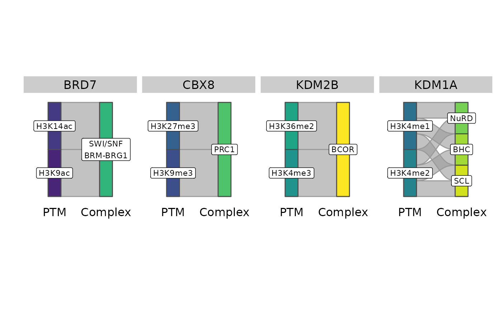

``` r

net_edges_py_hp <- r_to_py(net_created_hp$net_edges)
net_vertices_py_hp <- r_to_py(net_created_hp$net_vertices)
```

``` python
import pandas as pd, networkx as nx
from pyvis.network import Network
# Create NetworkX graph object
G2 = nx.Graph()

# Generate a nested dictionary/tuple with the node of interest ("Symbol") and 
# the relevant attributes (shape and complex)
node_list_hp = []
for i, row in r.net_vertices_py_hp.iterrows():
  node_list_hp.append((row["Symbol"], {"color": {"background": row.Colors, "border": row.Border}, "Complex": row.Complex, "shape": row.Shapes}))
G2.add_nodes_from(node_list_hp)

# Generate a tuple for edges connecting proteins with PTMs
edge_tup_hp = []
for i in range(len(r.net_edges_py_hp["Symbol"])):
  edge_tup_hp.append((r.net_edges_py_hp["Symbol"][i], r.net_edges_py_hp["PTM"][i]))
G2.add_edges_from(edge_tup_hp)

# Remove self-loops
G2.remove_edges_from(nx.selfloop_edges(G2))

# Now remove nodes without edges
lone_nodes_hp = [node for node, degree in G2.degree() if degree == 0]
G2.remove_nodes_from(lone_nodes_hp)
# To change the parameters of what's being graphed, adjust the initial call to Network()
net2 = Network(height="900px", notebook = True, select_menu = True, cdn_resources = "in_line")
net2.from_nx(G2)
net2.save_graph("networkx-pyvis-MCF2.html")
```

``` r

htmltools::renderDocument(htmltools::htmlTemplate("networkx-pyvis-MCF2.html"))
```

## 

## 

Select a Node by ID H3K4me1 KDM1A H3K4me2 H3K4me3 KDM2B H3K9me3 CBX8
H3K9ac BRD7 H3K14ac H3K27me3 H3K36me2

Reset Selection

Han, Rong, Xu Sun, Yue Wu, et al. 2024. “Proteomic and Phosphoproteomic
Profiling of Matrix Stiffness-Induced Stemness-Dormancy State Transition
in Breast Cancer Cells.” *Journal of Proteome Research* 23 (10):
4658–73. <https://doi.org/10.1021/acs.jproteome.4c00563>.

LeRoy, Gary, Peter A DiMaggio, Eric Y Chan, et al. 2013. “A Quantitative
Atlas of Histone Modification Signatures from Human Cancer Cells.”
*Epigenetics & Chromatin* 6 (1): 20.
<https://doi.org/10.1186/1756-8935-6-20>.
